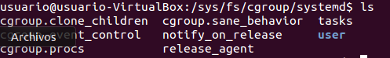
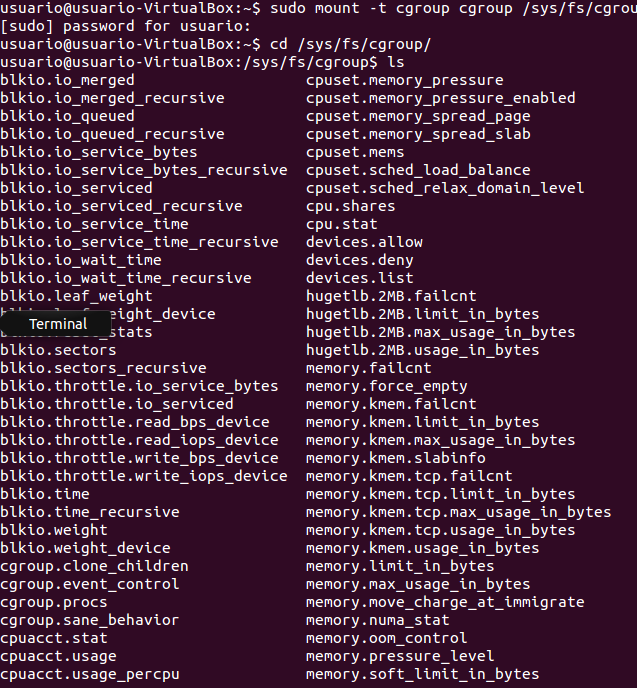

###Ejercicio 7: Comprobar si en la instalación hecha se ha instalado cgroups y en qué punto está montado, así como qué contiene.

Al acceder a la ruta /sys/fs/cgroup solo nos encontramos la carpeta systemd:

Montamos el sistema de ficheros y ahora si obtenemos lo siguiente:

