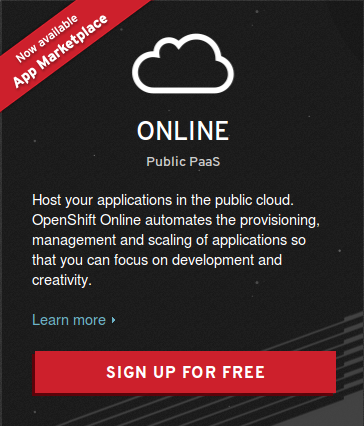

###Ejercicio 2: Darse de alta en algún servicio PaaS tal como Heroku, Nodejitsu u OpenShift.

Para darnos de alta en OpenShift, nos dirigimos a la web oficial (www.openshift.com) y elegimos la opción gratuita:

A continuación, seguimos el proceso de registro vinculando nuestra nueva cuenta a nuestro correo electrónico.