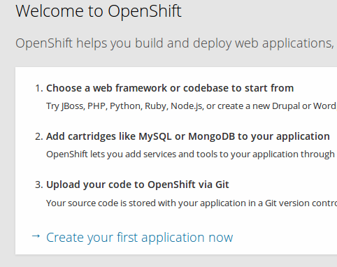
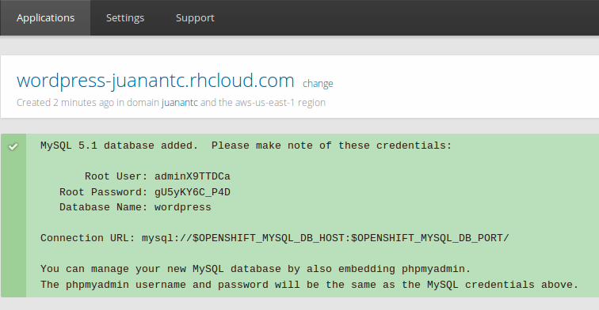
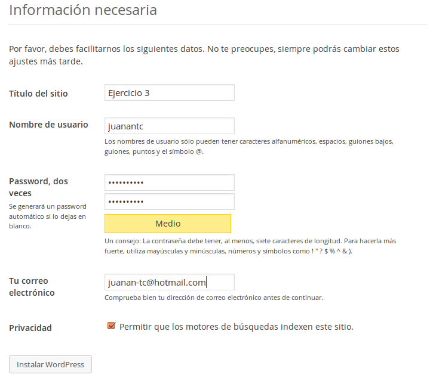

###Ejercicio3: Crear una aplicación en OpenShift y dentro de ella instalar WordPress.

Nos logueamos en la web y accedemos a crear nuestra primera aplicación:

Elegimos WordPress para instalarlo:

Una vez instalado nos aparece lo siguiente:

Ya podemos empezar la configuración: selección de idioma, titulo del sitio...

Una vez finalizada la configuración ya tenemos podemos ver nuestro Hola mundo!

