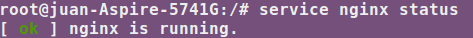

###Ejercicio 5: Instalar una jaula chroot para ejecutar el servidor web de altas prestaciones nginx.

Para instalar nginx he usado la jaula creada en ejercicios anteriores (sid) realizando los siguientes pasos:

	sudo chroot .

Una vez dentro instalamos nginx:

	apt-get install nginx

Lanzamos el servicio:

	service nginx start

Verificamos que realmente esta funcionando:

	service nginx status

Captura:

