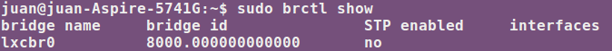

###Ejercicio 2: Comprobar qué interfaces puente se han creado y explicarlos.

Se ha creado un puente llamado lxcbr0 para poder tener acceso a la red desde el contenedor. El puente no tiene asociado ninguna interface y el id parece ser uno por defecto.

