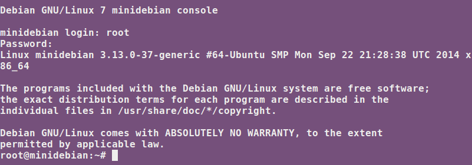
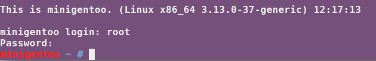

###Ejercicio 3:

####1. Crear y ejecutar un contenedor basado en Debian.

Creación del contenedor:

	sudo lxc-create -t debian -n minidebian

Para arrancar el contenedor:

	sudo lxc-start -n minidebian

####2. Crear y ejecutar un contenedor basado en otra distribución, tal como Fedora. Nota En general, crear un contenedor basado en tu distribución y otro basado en otra que no sea la tuya. Fedora, al parecer, tiene problemas si estás en Ubuntu 13.04 o superior, así que en tal caso usa cualquier otra distro. Por ejemplo, Óscar Zafra ha logrado instalar Gentoo usando un script descargado desde su sitio, como indica en este comentario en el issue.

Creación del contenedor:

	sudo lxc-create -t gentoo -n minigentoo

Para arrancar el contenedor:

	sudo lxc-start -n minigentoo

