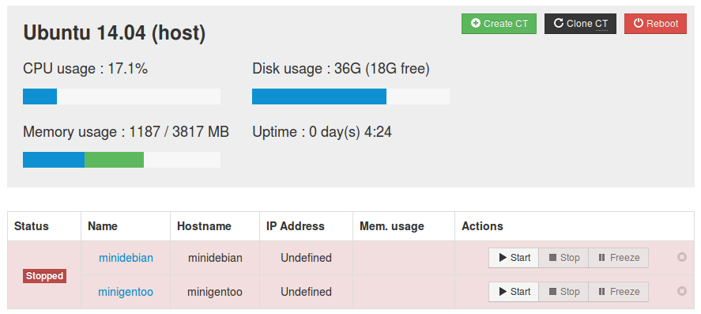

###Ejercicio 4:

####1. Instalar lxc-webpanel y usarlo para arrancar, parar y visualizar las máquinas virtuales que se tengan instaladas.

	wget http://lxc-webpanel.github.io/tools/install.sh -O - | sudo bash

####2. Desde el panel restringir los recursos que pueden usar: CPU shares, CPUs que se pueden usar (en sistemas multinúcleo) o cantidad de memoria.

Limitamos la memoria, por ejemplo, a 2048 MB.

