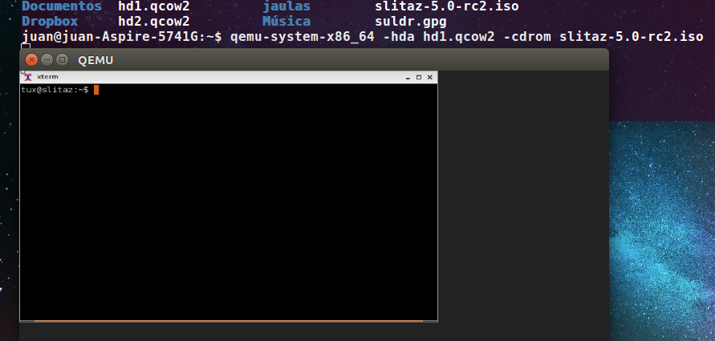
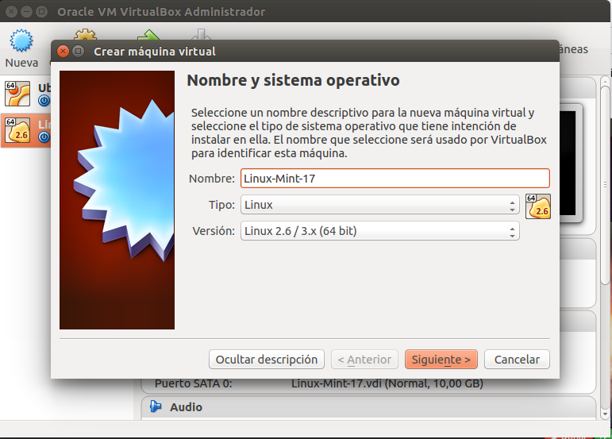
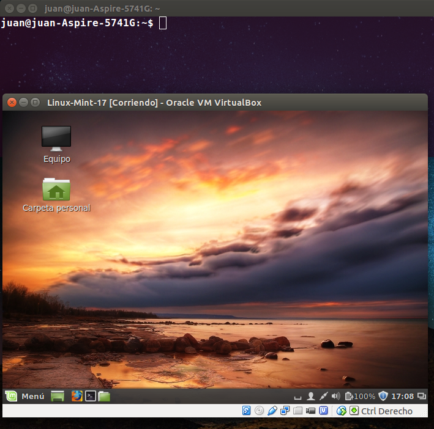

###Ejercicio 2: 
####1. Crear varias máquinas virtuales con algún sistema operativo libre tal como Linux o BSD. Si se quieren distribuciones que ocupen poco espacio con el objetivo principalmente de hacer pruebas se puede usar CoreOS (que sirve como soporte para Docker) GALPon Minino, hecha en Galicia para el mundo, Damn Small Linux, SliTaz (que cabe en 35 megas) y ttylinux (basado en línea de órdenes solo).

####2. Hacer un ejercicio equivalente usando otro hipervisor como Xen, VirtualBox o Parallels.

Creamos el HD virtual:

	qemu-img create -f qcow2 hd1.qcow2 500M

Instalamos SliTaz:

	qemu-system-x86_64 -hda hd1.qcow2 -cdrom slitaz-5.0-rc2.iso

Vamos a crear otra MV usando VirtualBox:

En primer lugar instalamos VirtualBox

	sudo apt-get install virtualbox 

Una vez instalado, seguimos los pasos para crear una máquina virtual, en este caso con Linux Mint 17:

Máquina ya funcionando:

