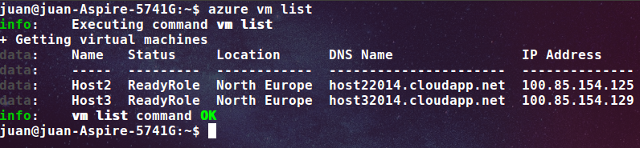
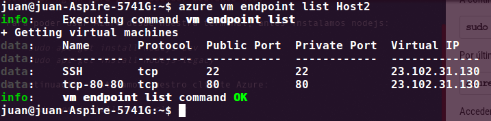
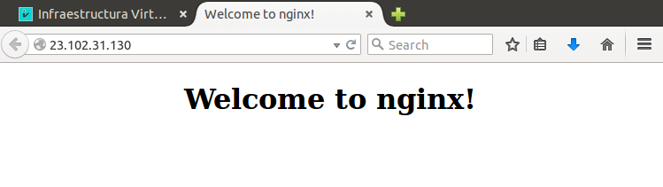

###Ejercicio 5: Crear una máquina virtual ubuntu e instalar en ella un servidor nginx para poder acceder mediante web.

Para poder usar Azure desde nuestra terminal, antes instalamos nodejs:

    sudo apt-get install nodejs-dev
    sudo apt-get install nodejs-legacy

A continuación instalamos nuestro cliente Azure:

	sudo npm install azure-cli -g

Por último, descargamos un certificado que asocie nuestra cuenta con el SO.

	azure account download

Accedemos al enlace que nos da, descargamos el certificado y por último lo importamos:

	azure account import RUTA_DEL_CERTIFICADO

A continuación vemos las imagenes disponibles:

Como se puede ver, ya tengo dos máquinas creadas para nuestro proyecto de la asignatura (Azure no me permite crear más).

Voy a usar una de ellas para instalar nginx:

Me conecto por ssh e instalo nginx:

	ssh usuario@host22014.cloudapp.net
    sudo apt-get install nginx
    
Abrimos el puerto 80:

	azure vm endpoint create Host2 80 80

Como se puede ver, ya está abierto:

Por último, comprobamos que el servidor está funcionado:

