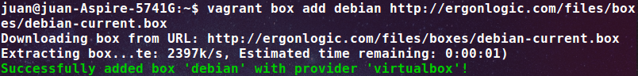
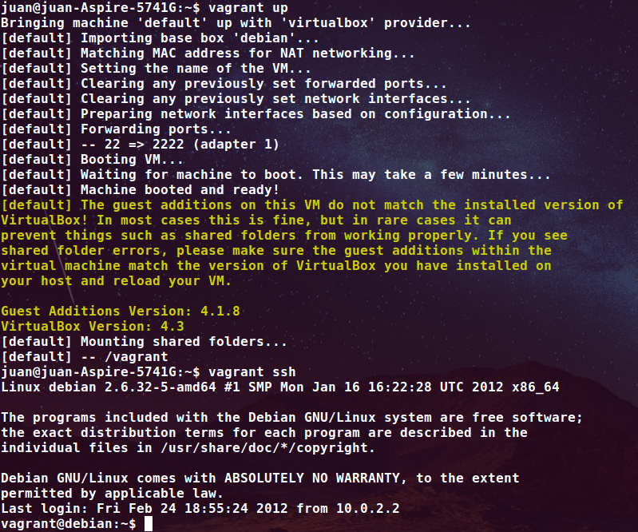

###Ejercicio 7: Instalar una máquina virtual Debian usando Vagrant y conectar con ella.

En primer lugar, isntalamos Vagrant:

	sudo apt-get install Vagrant

Instalamos una máquina Debian:

	vagrant box add debian http://ergonlogic.com/files/boxes/debian-current.box

Se instala con éxito:

Creamos el fichero de Vagrant(Vagrantfile):

	vagrant init debian

Nos conectamos a la máquina:

