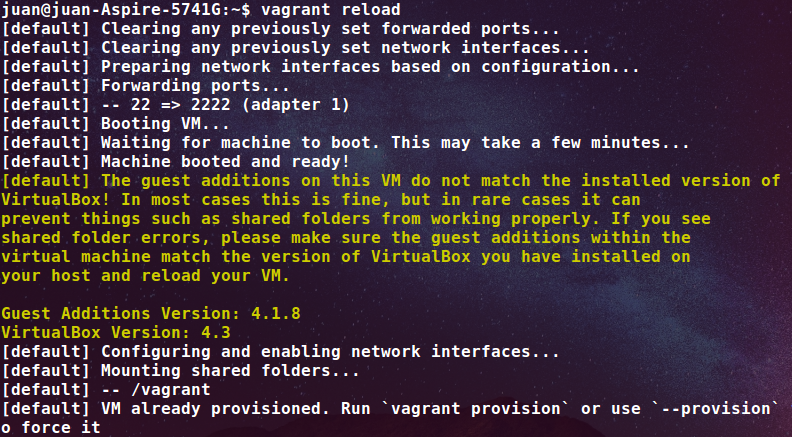

###Ejercicio : Configurar tu máquina virtual usando vagrant con el provisionador ansible

Lo primero que debemos hacer es asignarle una IP a nuestra máquina Vagrant para poder indicarle a Ansible la máquina a que se debe conectar. Esto lo hacemos en  el Vagrantfile introduciendo:

config.vm.network :private_network, ip: "192.168.50.4"

Para que está configuración sea efectiva debemos recargar la configuración del Vagrantfile:

