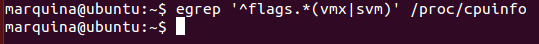

## EJERCICIO  10 :

El modelo de mi procesador es:** Intel Core i5-2467M **

Para comprobar si en el procesador tienes instalados estos flags usamos el comando `egrep '^flags.*(vmx|svm)' /proc/cpuinfo`, ya que tal y como viene en los apuntes, nos devolverá las líneas completas que contengan el flag vmx o svm, del fichero del sistema de ficheros virtual (/proc/cpuinfo).

En mi caso esta desactivado ya que no me devuelve ninguna línea:

