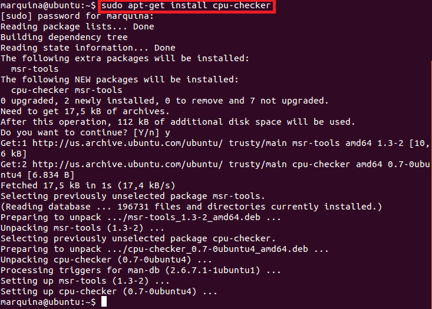
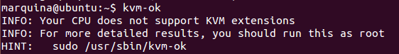

## EJERCICIO  11 :

Para comprobar si el núcleo instalado en mi ordenador contiene el módulo del kernel KVM, primero debemos instalar el programa kvm-ok, ya que no viene instalado por defecto, para ello usamos el comando :

` sudo apt-get install cpu-checker`

Ahora que ya lo tenemos instalado vasta con usar el comando `kvm-ok` para comprobarlo:

y como se puede observar en la salida mi ordenador no contiene el módulo del kernel KVM.