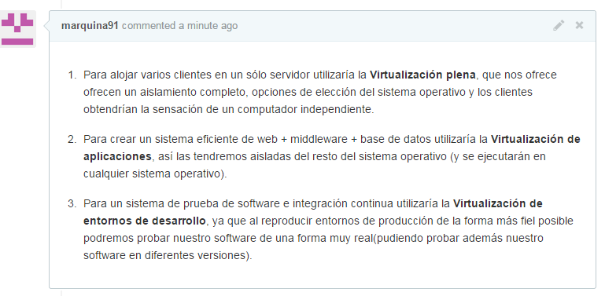
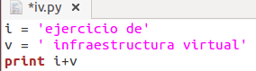
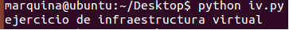
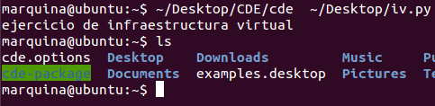

### Ejercicio 3:
A)



B) Como lenguaje interpretado he elegido Python, y he credo un programa simple que consiste en 2 cadenas que se imprimirán dando como resultado el mensaje "ejercicio de infraestructura virtual".

Este es el código:



y así como queda al ejecutarse:



Para empaquetarlo en CDE primero lo instalamos:
```
$ git clone git://github.com/pgbovine/CDE.git
$ cd CDE
$ make
```
y ya esta instalada ahora creo la versión portable del programa que he hecho anteriormente, para ello le pasamos a CDE el programa creado de la siguiente manera:



y como podemos observar se ha creado la carpeta cde-package que contendrá todas las dependencias necesarias para que nuestro programa se ejecute en cualquier distribución de linux.

