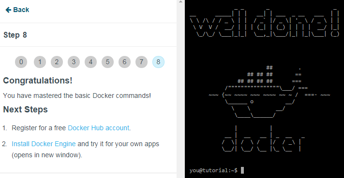

El tutorial cuenta con 9 pasos (del 0 al 8), voy a ir describiendo que se pide en cada paso:

0. Nos informan que con "docker version" obtenemos el tipo de versión y que poniendo solo "docker" tenemos la lista completa de todas los argumentos posibles.

1. Nos enseñan a buscar imágenes en contenedores con el comando "docker search < string > ".

2. Nos enseñar a descargarnos las imágenes de los contenedores con el comando "docker pull  < username >/< repository >", y nos descargamos la del tutorial.

3. Nos enseñan a arrancar el contenedor (la imagen) y a mostrar en ella una cadena ("hello world") usando el comando " docker run learn/tutorial echo "hello world" "

4. En este paso nos enseña a instalar aplicaciones en el contenedor (que es similar a ubuntu ya que esta basada en ubuntu la imagen), e instalamos la aplicación ping con el comando "docker run learn/tutorial apt-get install -y ping"

5. Nos enseñan a guardar los cambios de nuestros contenedores, en este paso guardaremos el conedor hecho hasta el momento con el nombre 'aprender/ping' para ello usamos el comando "docker commit 698 learn/ping". Dónde 698 es el ID de nuestro contenedor y se encuentra usando el  comando "docker ps -l" y solo es necesario poner 3 o 4 caracteres normalmente.

6. Ya tenemos un contenedor que se puede ejecutar en cualquier computadora dónde docker pueda ejecutarse, y lo comprobamos ejecutando el comando "docker run learn/ping ping google.com"

7. En este paso nos enseñan a ver la información útil de un contenedor que esta en ejecución para ello primero vemos todos los contenedores en ejecución con "docker ps" y luego con ID del contenedor del que deseamos ver la información (3 o 4 caracteres bastaran) usamos el comando "docker inspect < ID >" en el ejemplo hemos usado el comando "docker inspect efe"

8. El último paso del tutorial, nos enseñan como registrar el contenedor para compartirlo con otras personas usando el comando "docker push".

Al final se nos muestra un mensaje de que hemos hecho correctamente el tutorial y se nos mandan los pasos de crearnos una cuenta e instalar Docker

###### AVANZADO:

(CREANDO UNA APLICACIÓN WEB SIMPLE CONTENEDORIZADA)

Para este apartado hemos debido de crearnos previamente una cuenta en Docker e instalado el programa.

Ahora nos creamos un contenedor, para ello primero nos bajamos una imagen en mi caso la de ubuntu (version 12.04) y creamos el contenedor:

`docker run -d -i -t -p 8000:8000 ubuntu:12.04 /bin/bash`

 Ahora vamos a instalar apache2
 
`apt-get update `

 `apt-get install apache2`

 
 Salimos del contenedor con :
 
  `exit`

Ahora obtenemos la IP para comprobar que funciona:

`docker inspect -f '{{ .NetworkSettings.IPAddress }}' ID_contenedor`

recordar que podemos ver el ID (como ya sabemos del tutorial) con:

`docker ps -l`

 Y ya tenemos arrancada nuestra aplicación web.
 
 Si por alguna situación apache no se ejecuta nada más arrancar (lo digo por experiencia propia) accedemos al contenedor con :
 
 
`docker attach ID_contenedor `

y lo inciamos manualmente:

` /etc/init.d/apache2 restart `

Y ya al meternos en la dirección IP obtenida antes vemos que funciona correctamente.
