## EJERCICIO 6 :

###### 1)

Para crear un proyecto basta con estar logeado en GitHub y en la barra de herramientas de GitHub seleccionar new repository:

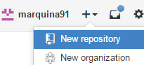

Después nos saldrá el menú para proporcionar de un nombre, descripción, tipo de privacidad y si queremos añadir un readme (señalado con rojo en la imagen ya que es una de las cosas que se pide en el ejercicio), y lo creamos pinchando en create repository:

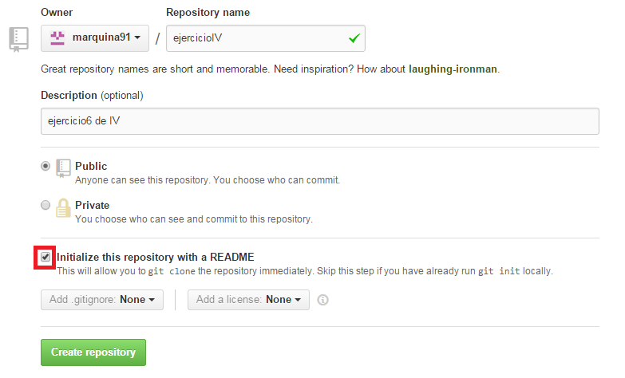

Ahora para descargarlo con git copiamos el url de nuestro repositorio recién cambiado:

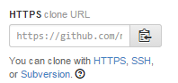

Y en nuestro terminal git introducimos el siguiente comando(importante situarse ates en el directorio dónde queremos copiarlo):

`git clone nuestro_URL`

como se muestra a continuación:

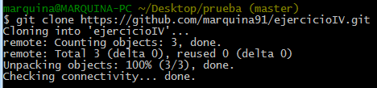

Y observamos que efectivamente tiene el readme:

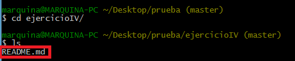

###### 2)

Lo primero que haremos será modificar el readme:

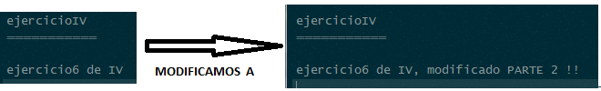

Comprobamos que realmente se ha modificado con  `git status`:

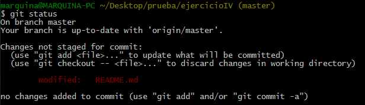

Como todo es correcto lo añadimos al INDEX con `git add .` y comprobamos que esta ya en el INDEX (saldrá en verde) con `git status` :

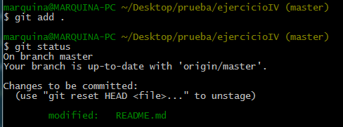

Hecho esto ya nos queda subirlo a nuestro Repositorio para ello primero lo añadimos al HEAD con ` git commit -m "comentario descriptivo" `  y comprobamos que no hay nada por modificar con `git status` :

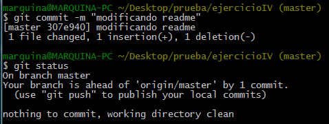

Por último ya mandamos los cambios de nuestro repositorio al repositorio mediante el comando `git push ` :

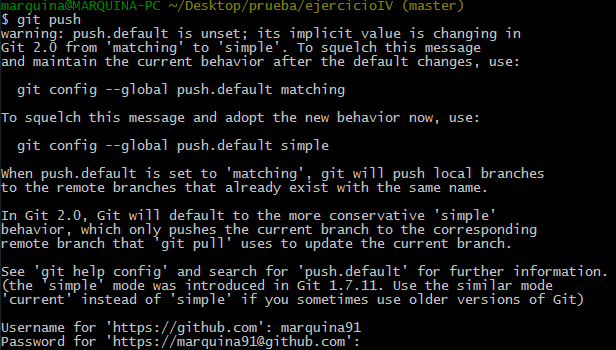

y comprobamos en el GitHub que efectivamente se han registrado la modificación :

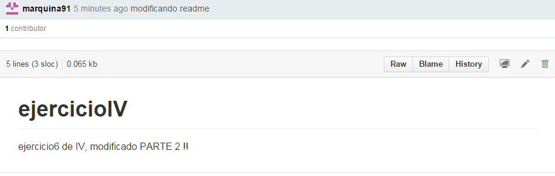