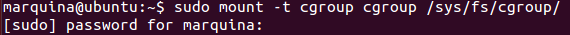

## EJERCICIO 7 :
 En mi distribución de Linux no venia montada y la he montado con el comando
``mount -t cgroup cgroup /sys/fs/cgroup/`` :

Luego he comprobado que ya estaba correctamene montada median el comando ` ls /sys/fs/`:

Por lo tanto ya sabemos dónde esta montado (/sys/fs/), y lo que contiene mediante el comando `ls /sys/fs/cgroup/`

