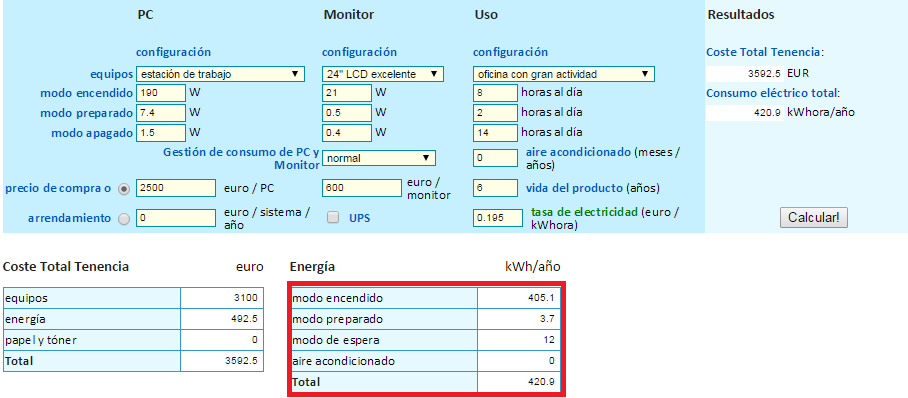

## EJERCICIO  8 :

###### 1)

Lo primero que necesitamos para hacer este ejercicio es crear los grupos de control, pero como viene en los apuntes para ello antes necesitamos tener los permisos de de superusuario para ello introducimos el comando `sudo su - root` y creamos los 3 grupos con los siguientes comandos :

`mkdir /sys/fs/cgroup/navegador` (para el navegador como indica el nombre)

`mkdir /sys/fs/cgroup/procesadortexto`(para el procesador de textos como indica el nombre)

`mkdir /sys/fs/cgroup/otroproc` (para otro proceso como indica el nombre, en mi caso sera la aplicación de amazon)

Ante de poder asignar procesos a grupos de control necesitaremos introducir en cada grupo los siguientes comandos (como se indica en los apuntes), ya que sino nos dará error porque al crear los grupos de control se crean los archivos por defecto con valores vacíos:

`echo 0 > /sys/fs/cgroup/<nombre_grupo>/cpuset.cpus`

`echo 0 > /sys/fs/cgroup/<nombre_grupo>/cpuset.mems `

Ahora vamos a buscar el PID de los procesos que queremos asignar a cada grupo y tras eso le asignaremos el proceso, para la búsqueda del PID usaremos `ps aux | grep <proceso_a_buscar>` :

y se lo asignaremos al grupo que queramos con la instrucción `echo <IDproceso> >/cgroup/<nombre_del_grupo>/tasks` quedando de la siguiente manera (notar que al grupo del procesador de texto le he asignado 2 procesos, esto es debido a que el Office usa 2 procesos para levantar el programa):

Y ahora ya podemos comprobar el uso de recursos mediante el comando `cat /sys/fs/cgroup/<grupo>/cpuacct.usage`:

Dónde comprobamos que el navegador consume casi 10 veces más de recursos que el procesador de textos (que consume casi el doble que la aplicación de amazon).

_ _ _

* * *

###### 2)

Para calcular los costes he utilizado esta [calculadora](http://www.eu-energystar.org/es/es_008.shtml), ya que me calcula los costes de un ordenador según su tipo, tipo de actividad de la oficina, calcula también el monitor, etc. Por la que la he visto muy útil y practica para este ejercicio.
He configurado mi ordenador de la siguiente manera (nótese que en el cuadro de energía se muestran el consumo según el modo de nuestro ordenador):

En definitiva viendo los gastos el total en adquirir el ordenador de la oficina (equipo + monitor) ha sido de 3100 € (que es lo realmente debemos amortizar, ya que esta en base imponible), y el gasto de energía ha sido de 492.5 € que se nos deducirá íntegramente cada año.

Por lo tanto la amortización la voy a poner a 6 años (ya que por defecto es el valor que salia con la configuración que he elegido), por lo que haré una amortización durante 5 años del 17% y la del último año del 15%.

Por lo tanto 3100 * 0,17 = 527 , así que amortizaremos esto más el gasto energético durante los primeros 5 años

El último año amortizaremos 3100 * 0,15 = 465 € (que será lo que queda por pagar de la base imponible)

Quedando la amortización a 6 años así suponiendo que adquirimos el ordenador al empezar el año :
* Año 2014: 527 + 492.5 = **1019,5 €**
* Año 2015: 527 + 492.5 = **1019,5 €**
* Año 2016: 527 + 492.5 = **1019,5 €**
* Año 2017: 527 + 492.5 = **1019,5 €**
* Año 2018: 527 + 492.5 = **1019,5 €**
* Año 2019: 465 + 492.5 = **957,5 €**

