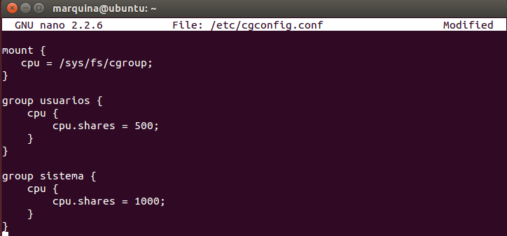

## EJERCICIO  9 :

###### 1)

A la hora de limitar hay que tener mucho cuidado ya que si limitamos recursos de una computadora que necesita de estos, podemos hacer tediosa o casi imposible de realizar algunas tareas.

Sin embargo me parece muy útil a la hora de limitar computadores de usuarios que solo se vayan a dedicar a publicar cosas por Internet (desde el punto de vista empresarial), ya que estas usaría poco recursos de la máquina y así se evitaría cargar excesivamente el trafico, o a la hora de limitar a un usuario del tipo encargado de seguridad (que le basta con leer el correo).

En conclusión son muy útiles si se estudia bien que recursos limitar y a que usuarios o computadores, teniendo esto en cuenta las empresas pueden beneficiarse de esto ya que pueden ahorrar mucho dinero.

* * *

* * *

###### 2)

Para poder configurar el fichero de cgcreate lo primero es tener instalado el paquete cgroup-bin, para ello ejecutamos el siguiente comando:

`sudo apt-get install cgroup-bin libcgroup1`

En caso de tener errores de dependencias (error que yo he tenido) tendremos que poner el siguiente comando:

 `sudo apt-get -f install`
 
 y luego el comando que he mencionado anteriormente `sudo apt-get install cgroup-bin libcgroup1`.
 
 Luego creamos 2 grupos (en mi caso usuarios y sistema) y editamos el archivo de configuración `/etc/cgconfig.conf`  dejándolo de la siguiente manera :
 
 
 
 Que lo que hará será asignar el doble de recursos al grupo sistema.

Después de esta asignación debemos asignar al grupo sistema que sea el que ejecute los procesos del root, y al grupo usuarios el de los usuarios, para ello ahora configuraremos el archivo `/etc/cgrules.conf` dejandolo de la siguiente manera:

 

y ya tenemos una política que da menos prioridad a los procesos de usuario (la mitad de prioridad comparado a los del sistema).

* * *

* * *

###### 3)

Primero instalamos htop con el comando `sudo apt-get install htop`, y ya podemos comprobar los efectos de la migración en tiempo real con el comando `htop`:

* * *

* * *

###### 4)
Lo primero creamos el grupo al que le vamos a dar esta prioridad yo lo he nombrado miserver:

` sudo cgcreate -a marquina -g blkio:miserver`

Una vez tenemos nuestro grupo configuramos `/etc/cgconfig.conf` para indicarle la prioridad esta ves solo afectara a blkio (como hemos indicado al crear el grupo), quedando de la siguiente manera:

 
 
 Y ya lo tenemos configurado correctamente. Notar que le hemos dado un valor de 800 que corresponde a casi la totalidad de la prioridad.

