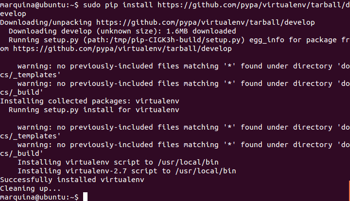

### EJERCICIO  1 :

El entorno visual que he elegido instalar ha sido **virtualenv**.

Primero nos instalamos Pip (herramienta para instalar paquetes de python) con el comando :
` sudo apt-get install python-pip python-dev build-essential ` .

y una vez instalado lo actualizamos a la última versión con el comando
`sudo pip install --upgrade pip `

Por último, nos descargamos e instalamos la última versión del entorno ` sudo pip install https://github.com/pypa/virtualenv/tarball/develop` :

Y ya tenemos nuestro entorno visual instalado.