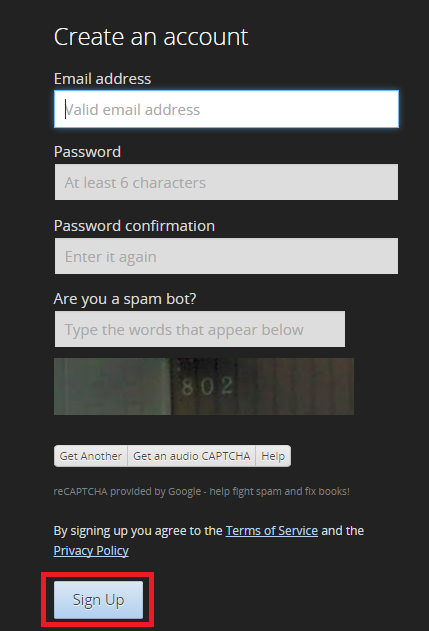
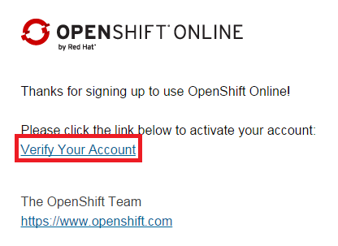

### EJERCICIO 2 :

En este Ejercicio he decidido darme de alta en **OpenShift**, ya que es de los más completos.

Para darnos de alta nos vamos a la [web oficia](https://www.openshift.com/) y en la esquina superior a la derecha encontraremos la opción de registrarse (SIGN UP) :

Tras pinchar en la opción de registrarse se nos solicitaran los datos para darnos de alta, los ponemos y le damos a registrarse (SIGN UP) :

Si se han introducido los datos correctamente ya estaremos casi registrados, solo nos quedará aceptar un enlace que nos enviaran al correo que hallamos puesto, al hacer clic en el enlace ya tendremos nuestra cuenta:

