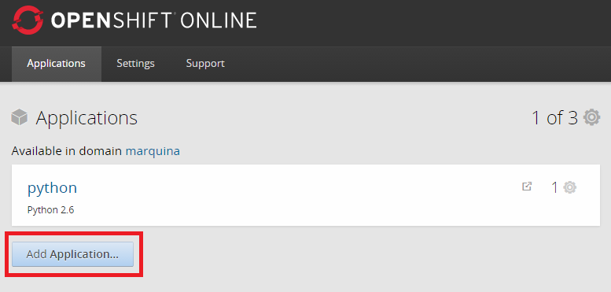
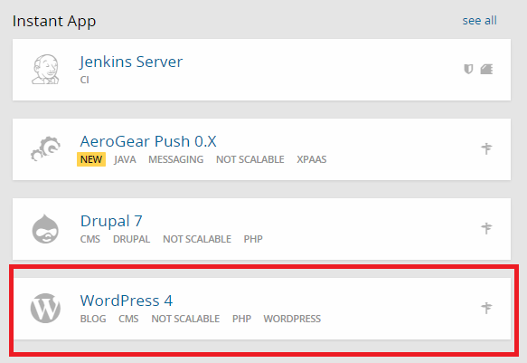
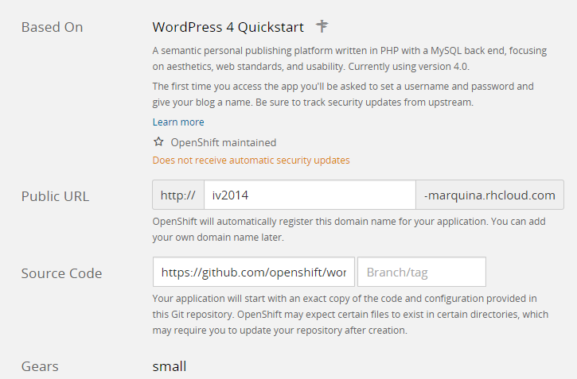
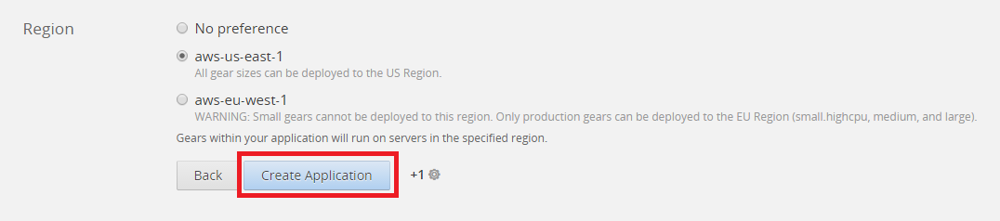
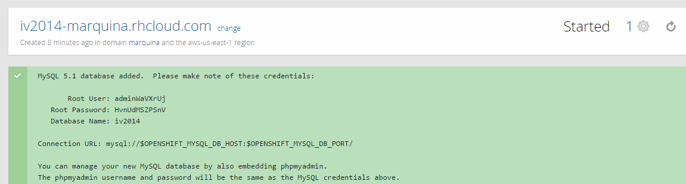
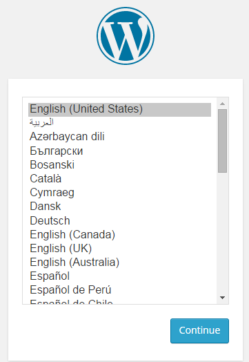

### EJERCICIO 3 :

Para instalar WordPress en una aplicación, lo primero que debemos hacer es loguearnos y luego darle a la opción de crear aplicación (Add Application) :

Se nos pedirá que elijamos el tipo de aplicación que deseamos, para nuestro caso elegimos WordPress nos vamos a la sección de Instant App y lo seleccionamos :

Y nos pedirá que configuremos como deseemos la aplicación:

Una vez configurada a nuestro antojo le damos a crear aplicación (create application) :

El último paso será si queremos cambiar el código de nuestra aplicación (nosotros por defecto al seleccionar WordPress se nos proporcino un código de ejemplo del programa, por lo que nos vale) y seleccionamos que deseamos continuar (ya que para nuestro ejercicio viene perfecto el código que tenemos) :

Y ya tenemos nuestra aplicación creada (y nos muestran todos los datos que podemos necesitar a la hora de administrarla) :

Por último comprobamos que lo hemos hecho correctamente, y nos introducimos en el enlace que pusimos de nuestra aplicación http://iv2014-marquina.rhcloud.com/wp-admin/install.php, si todo es correcto te saldrá el instalador de WordPress:

