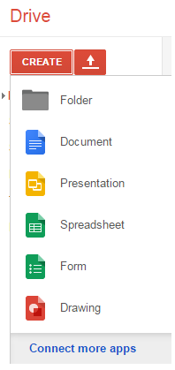
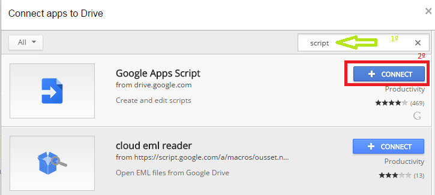
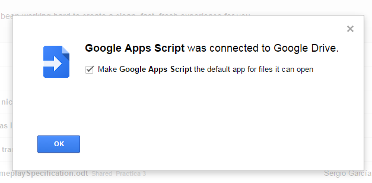
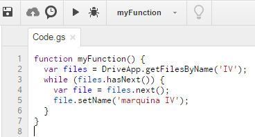
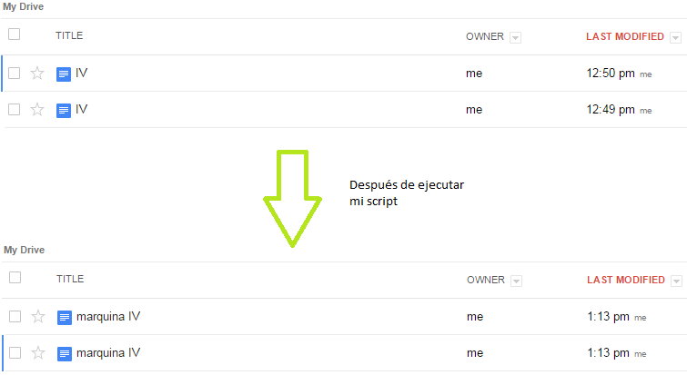

### EJERCICIO 4 :

Lo primero que necesitamos para crear el script es la herramienta con la que los vamos a crear y probar, para ello nos vamos a nuestro [DRIVE](https://drive.google.com/#my-drive) y le damos a create->connect more apps:

Nos saldrá una ventana para elegir la aplicación que deseamos conectar en el recuadro de búsqueda ponemos `script` y la primera que nos sale la conectamos (haciendo clic en connect) :

Una vez conectada ya nos deja usarla, así que ahora ya si podemos crear el script, para ello le damos create->Script, y nos saldrá una ventana para hacer esta aplicación por defecto, aceptamos y nos disponemos ha hacer nuestro script:

Para el script he usado 2 funciones `DriveApp.getFilesByName`(para obtener una lista de los documentos con un nombre especificado) y `setName` (para dale nombre a un documento), y este ha sido el resultado:

Mi script lo que hace es cambiar todos los documentos de mi Drive con el nombre 'IV' (he creado 2 para hacer la prueba) y los cambia por el nombre 'marquina IV' (como se puede observar en el script), aquí esta la prueba de que funciona correctamente aún con 2 archivos del mismo nombre:

