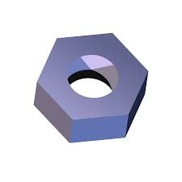

### EJERCICIO 5 :

Un sistema de automatización de la construcción  para python  es **web.py** (orientado a aplicaciones en Internet), que pueden descargarlo del siguiente repositorio http://github.com/webpy/webpy

* * *

**Buildbot**,también sistema de automatización de la construcción  para python (entre otros lenguajes), y pueden instalarlo siguiendo los pasos de su página [web](http://docs.buildbot.net/0.8.7p1/manual/installation.html)

