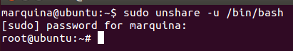

### EJERCICIO 1:

Lo primero que vamos a hacer es crear el espacio de nombres, dónde luego montaremos la ISO, para realizar este primer paso es tan fácil como seguir los apuntes de la asignatura:

Creamos un nuevo namespace UTS:   `sudo unshare -u /bin/bash`:

Y ahora procedemos a montar la imagen ISO sobre él directorio que acabamos de crear siguiendo los siguientes pasos:

1. Creamos el directorio dónde vamos a montar nuestra imagen (en mi caso lo he llamado ejercicio1): `mkdir -p /mnt/ejercicio1`

2. Nos dirigimos al directorio donde está la imagen ISO que queremos montar: `cd Desktop`

3. Y montamos la imagen en el directorio que hemos creado en el primer paso (notar que sino estuviéramos en el directorio dónde se encuentra la imagen ISO deberíamos poner su path): `mount -o loop disk.iso /mnt/ejercicio1`

Y como podemos observar siguiente los siguientes pasos hemos montado la imagen ISO en el espacio de nombres de forma que no se puede leer más que desde él:

Una vez hemos montado la imagen comprobamos que efectivamente se ha montado correctamente:

y observamos que efectivamente la imagen corresponde a lo que había en la ISO  original (que en mi caso era un sistema operativo).