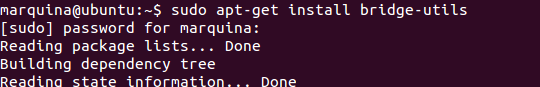
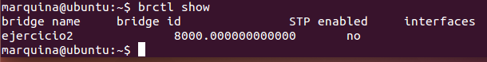
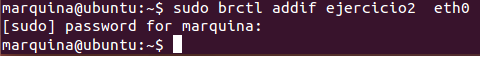
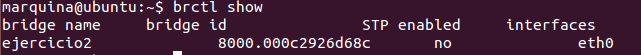
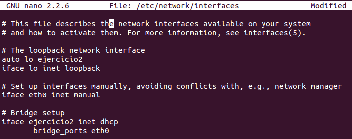
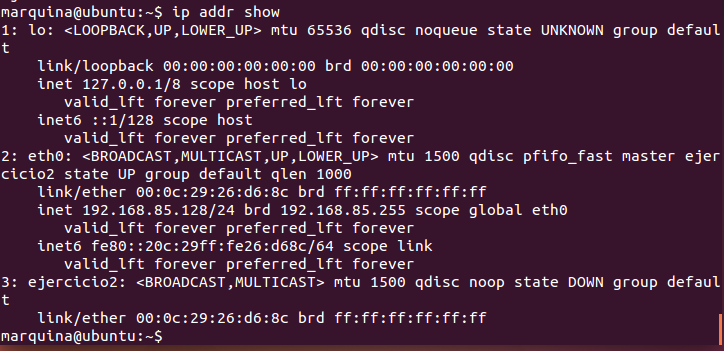

### EJERCICIO 2:

###### 1)
Antes de nada deberemos tener instalado el paquete de bridge-utils :
` sudo apt-get install bridge-utils` 

Y ahora ya podemos mostrar los puentes configurados en nuestro sistema operativo con el comando `brctl show` :

Y se puede observar que hay un puente (que lo he creado antes para practicar lo que se nos indicaba en los apuntes).

- - -
- - -

###### 2)
 Ahora usare el puente que ya he creado (interfaz virtual), si no lo hubiera creado tendría que hacerlo con el comando: `sudo brctl addbr ejercicio2`
 
Le añadimos la interfaz eth0 con el comando: `sudo brctl addif ejercicio2 eth0 `:
 
 
 
Y observamos que ya ha adquirido su id y tiene la interfaz añadida correctamente:

 
 
 Por último y para mejorar el puente configuramos el archivo etc/network/interfaces de la siguiente manera (lo he modificado para el uso DHCP):
 
  
  
  y ya tenemos nuestra interfaz virtual y asignada a la interfaz de red (con DHCP), y observamos que efectivamente es así con :  `ip addr show`:
  
  
 
 