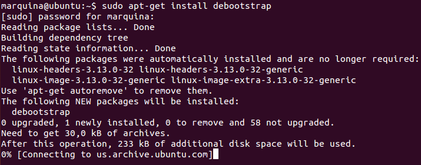
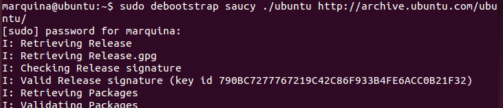
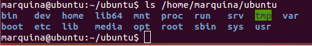
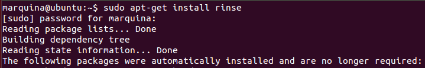
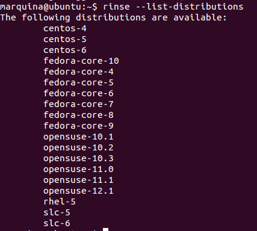
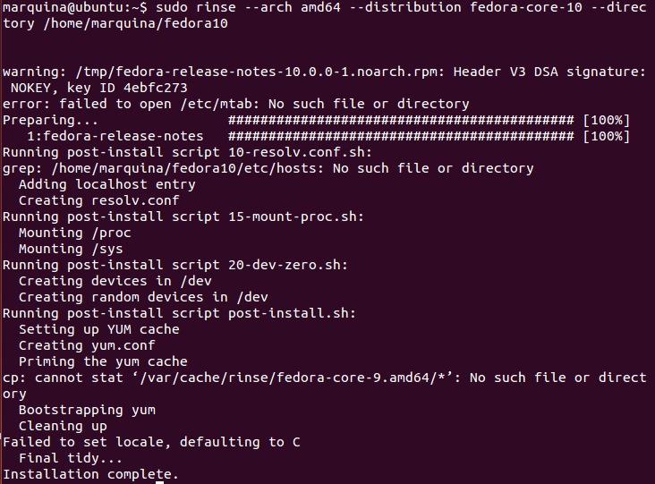

### EJERCICIO 3:

###### 1)

Antes de nada debemos tener instalado debootstrap, para ello usamos el comando `sudo apt-get install debootstrap`:

Y ya podemos crear nuestro sistema en el directorio : `sudo debootstrap saucy /home/marquina/ubuntu/ http://archive.ubuntu.com/ubuntu/`.

Notar que hemos elegido la versión (saucy, es decir, Ubuntu 13.10) que se instalara en el directorio que hemos especificado (/home/marquina/ubuntu/). También hemos omitido la orden de arquitectura, ya que si no la ponemos se creara para la arquitectura de la máquina por defecto (64 bits en mi caso), si se quisiera una de 32 bits necesitaríamos ponerla y especificarlo `--arch=i386` (como viene en los apuntes de la asignatura).

Ahora comprobamos que efectivamente se ha realizado correctamente: ` ls /home/marquina/ubuntu
`

Y ya lo tenemos correctamente nuestro sistema como se puede observar en la captura.

* * *

* * *

###### 2)

Para realizar este apartado debemos tener instalado Rinse, como no viene por defecto tendremos que instalarlo: `sudo apt-get install rinse`

Ya podemos comenzar a crear un sistema Fedora dentro de Debian, ahora debemos elegir que distribución deseamos instalar, para ello recomiendo antes ejecutar el comando `rinse --list-distributions` que nos da una lista con las distribuciones que tenemos disponibles para instalar como podemos observar en la captura:

Para el ejercicio voy a elegir la distribución fedora-core-10 (que como podemos observar en la captura anterior está disponible), para ello haciendo uso de la herramienta Rinse ejecutamos el siguiente comando `sudo rinse --arch amd64 --distribution fedora-core-10 --directory /home/marquina/fedora10 `:

y ya tenemos instalado nuestra distribución fedora 10 para una arquitectura de 64 bits (si se deseara para un arquitectura de 32 bits había que poner el comando:` sudo rinse --arch i386 --distribution fedora-core-10 --directory /home/marquina/fedora10`), como podemos observar en la captura.