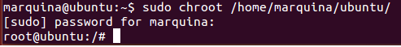
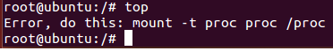
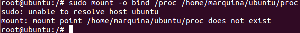
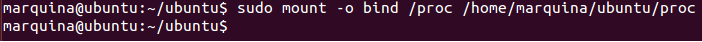
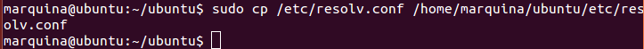
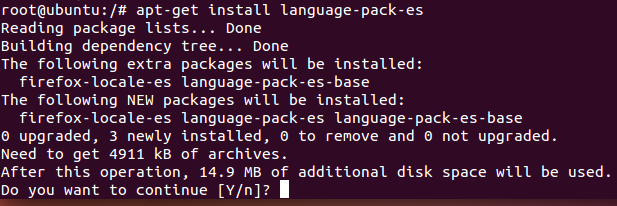
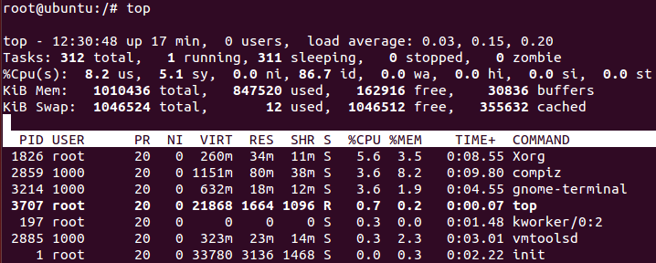

### EJERCICIO  4:

Para la configuración del sistema debianita vamos a elegir el que ya instale en el ejercicio anterior, sino lo tuviera instalado tendría que volver a repetir la instalación como vimos en el ejercicio anterior mediante el comando: `sudo debootstrap saucy /home/marquina/ubuntu/ http://archive.ubuntu.com/ubuntu/`

En mi caso ya lo hice en el ejercicio anterior, por lo que para configurarlo accedo al sistema pasándole el directorio donde lo instale: `sudo chroot /home/marquina/ubuntu/`

Una vez hemos accedido observamos que realmente no está configurado, mediante el comando `top` se puede observar fácilmente (como se nos indica en los apuntes):

Para configurar el sistema debemos estar fuera de la jaula (lo digo por experiencia propia), ya que si no te dará el siguiente error (lo cuál era de esperar, ya que entre otras cosas no tenemos en el sistema ese directorio, que es el de la jaula que estamos usando actualmente):

Una vez fuera de la jaula (usamos el comando `exit`), vamos a configurar el **filesystem virtual /proc** para poder gestionar los procesos, para ello ejecutamos el comando: `sudo mount -o bind /proc /home/marquina/ubuntu/proc` que nos monta el filesystem virtual /proc en nuestro sistema (jaula) :

También vamos a configurar el DNS, para tener acceso a internet desde la jaula (y así poder instalar paquetes), para ello usamos el comando: `sudo cp /etc/resolv.conf /home/marquina/ubuntu/etc/resolv.conf`

Ahora instalare el paquete en español para evitar errores (como se nos indica en la teoría):`apt-get install language-pack-es`:

Observamos que efectivamente puede instalarlos y descargarlos (gracias, entre otras cosas, a que le hemos dado acceso a internet).

Y también comprobamos que ya funciona correctamente la orden `top` (observamos que efectivamente es así):

Por lo tanto ya tenemos configurado correctamente nuestro sistema debianita.

