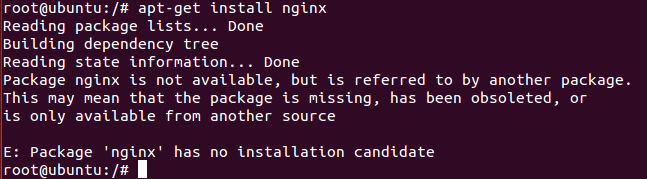
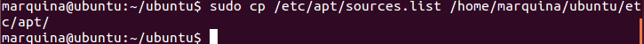
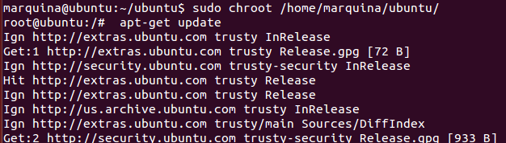
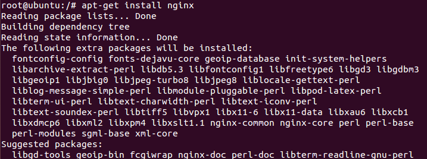
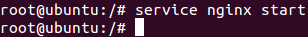

### EJERCICIO  5 :

Partimos de la jaula que he configurado en el ejercicio anterior para realizar este ejercicio, se nos pide ejecutar nginx, por lo que lo primero en que pensamos es en instalarlo `apt-get install nginx` pero nos da el siguiente error (lo cuál era lógico ya que si no sería el ejercicio más simple del mundo):

Para solucionarlo hay que copiar la lista de los repositorios a nuestra jaula, esto se hace mediante el comando (desde fuera de la jaula): ` sudo cp /etc/apt/sources.list /home/marquina/ubuntu/etc/apt/`

Luego entramos en la jaula ` sudo chroot /home/marquina/ubuntu/` y actualizamos la lista de repositorios con : `apt-get update`

Y ya se nos dejará instalar ngix sin problemas con el comando `apt-get install nginx`:

Solo nos queda arrancar nginx con`service nginx start`, para tenerlo ejecutándose en nuestra jaula:

