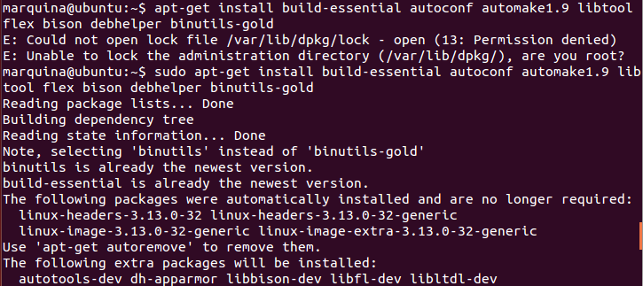

### EJERCICIO  6 :

Para realizar este ejercicio hay que descargarse [jailkit](http://olivier.sessink.nl/jailkit/jailkit-2.17.tar.gz), y lo instalamos con el comando (que descomprimirá el archivo y luego lo instalará directamente): `tar -xzvf /home/marquina/Downloads/jailkit-2.17.tar.gz && sudo jailkit-2.17/./configure && make && sudo make install`

Pero sale el siguiente error:

Por lo que vamos a instalar una serie de herramientas y paquetes con el comando:`sudo apt-get install build-essential autoconf automake1.9 libtool flex bison debhelper binutils-gold
`

Luego ejecutamos el siguiente comando para descargarnos jailkit: `wget http://olivier.sessink.nl/jailkit/jailkit-2.17.tar.gz`

Descomprimimos el archivo que nos acabos de descargar `tar xvfz jailkit-2.17.tar.gz`:

Accedemos a la carpeta del directorio dónde hemos descomprimido el archivo `cd jailkit-2.17/`, y compilamos el paquete `sudo ./debian/rules binary`:

Volvemos al directorio principal (/home/marquina/ en mi caso): `cd ..` e instalamos el paquete que acabamos de compilar `sudo dpkg -i jailkit_2.17-1_*.deb`

 Y ya tenemos instalado jailkit, ahora crearemos un directorio dónde crearemos la jaula: `sudo mkdir /home/jaulas`
 
 
 
 Hacemos que el directorio este poseído por el root: `sudo chown -R root:root /home/jaulas`
 
  
  
  Y mediante el comando ` sudo jk_init -v -j /home/jaulas/ jk_lsh basicshell netutils editors`,  creamos la jaula con los servicios que se podrán usar en ella (como se indican en los apuntes de teoría) y como está la orden `-v` se va viendo durante la creación que se está haciendo:
  
  
  
Es importante haber creado el directorio de la jaula en el home, ya que si se creara dentro de un usuario no se podría hacer (por ejemplo en /home/marquina/jaulas saltarían errores, es obvio pues entonces ese usuario podría modificarla aún sin permisos).

Después de haber creado la jaula con sus secciones, vamos a enjaular a un usuario. Primero lo creamos con el comando `sudo adduser prueba` (se llamara prueba el usuario):

  
  
Debemos editar la configuración del usuario para poder acceder a la shell más adelante (ya que la que viene por defecto es un shell limitado). Con el comando `sudo nano /home/jaulas/etc/passwd` modificamos el fichero de la siguiente manera:
  
    
  
  
  Ahora ya podemos enjaular al usuario "prueba" con el comando`jk_jailuser -m -j /home/jaulas prueba` (como se nos dice en los apuntes de teoría):
  
  
  
  

 Y comprobamos que efectivamente podemos acceder y funciona correctamente mediante ssh, con el comando `ssh prueba@localhost` :
 
  

Ahora miramos en el directorio del encarcelado (usuario "prueba"), que para el todo es normal, y que solo yo, que he creado la jaula, sé que este usuario está en una jaula:

  

Efectivamente para el usuario "prueba" todo es normal, y no sabe que está en una jaula.