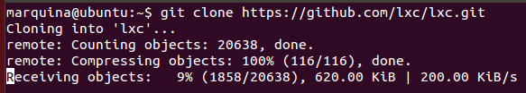
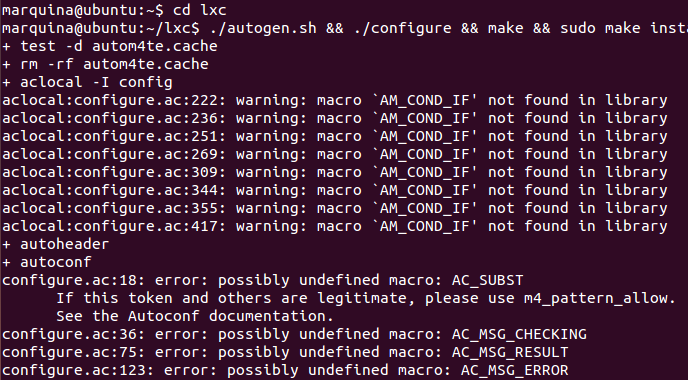
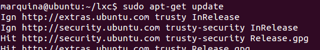
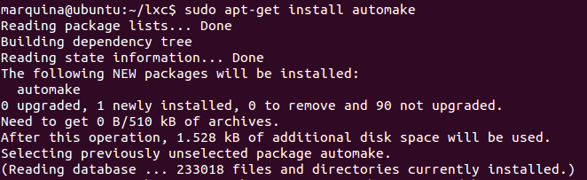
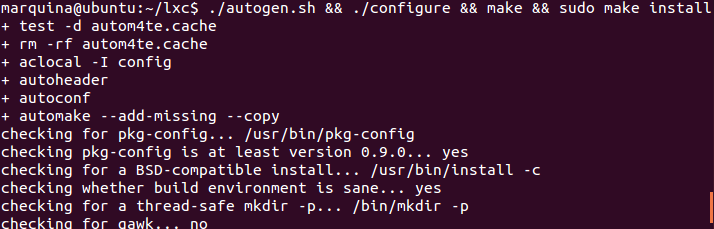
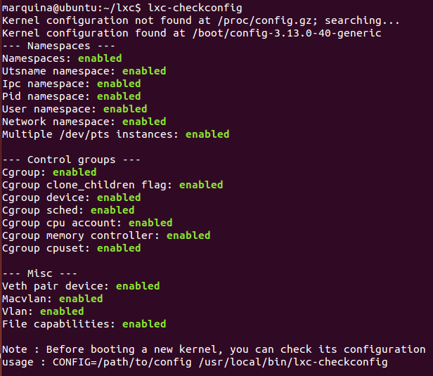

### EJERCICIO  1 :

Para instalarlo basta con poner el comando `sudo apt-get install lxc`, pero se nos recomienda instalar la última versión, para ellos nos la descargaremos del [GitHub](https://github.com/lxc/lxc) usando el git (que ya sabemos usar).Por lo tanto clonamos el repositorio con : `git clone:git clone https://github.com/lxc/lxc.git`:

E instalamos el **lxc** accediendo a la carpeta clonada `cd lxc`, y con el comando ` ./autogen.sh && ./configure && make && sudo make install`, pero nos salen los siguientes errores:

Viendo el error, lo solucionamos instalando la herramienta automake (después de analizar detenidamente el fallo), para ello usamos los siguientes comandos:
`sudo apt-get update` (actualizamos a las últimas versiones los paquetes)

`sudo apt-get install automake` (instalamos la herramienta que necesitamos)

Y ahora ya debemos de poder instalar** lxc** sin ningún problema, con el comando: ` ./autogen.sh && ./configure && make && sudo make install`

Efectivamente ya hemos podido instalarlo, sólo nos queda comprobar que nuestra máquina es compatible y que está correctamente configurado con el comando `lxc-checkconfig`

