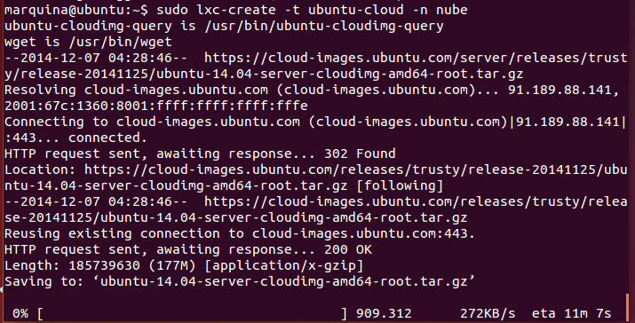
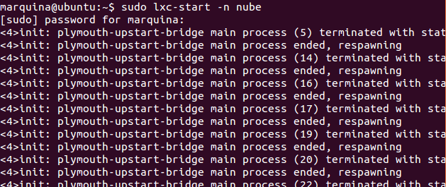
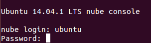
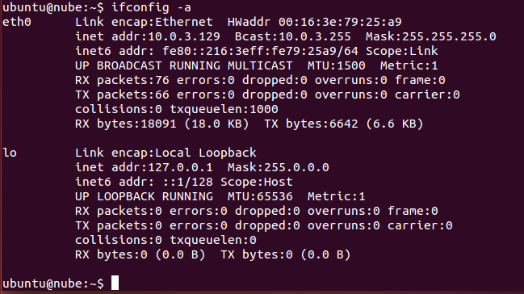
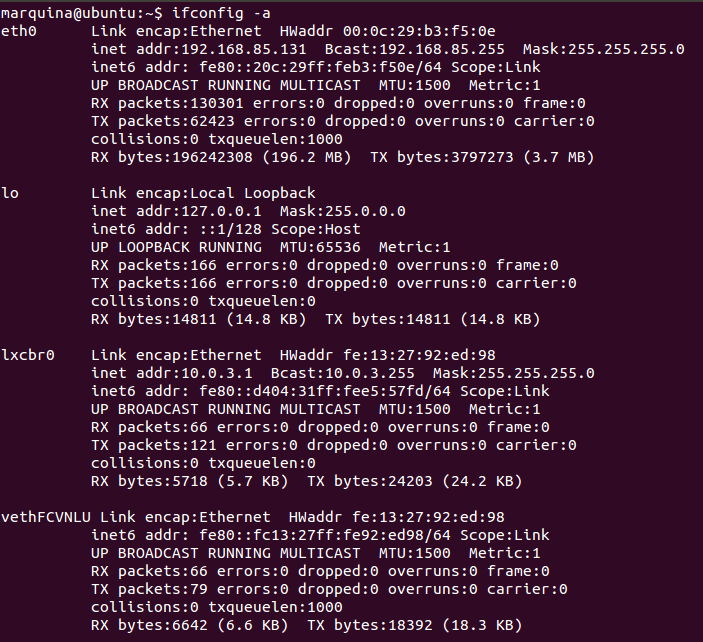
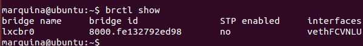

### EJERCICIO  2 :

En este ejercicio yo he creado un contenedor del tipo EC2 de Amazon, creamos el contenedor con el comando: `sudo lxc-create -t ubuntu-cloud -n nube` (notar que llamaremos a nuestro contenedor nube)

En este paso podemos encontrarnos con dos tipos  problemas (lo digo por experiencia propia):

###### Posible Problema 1)
Con el template a la hora de la descarga, si lo tenemos, deberemos antes descargarnos una serie de herramientas con el comando:`sudo apt-get install lxc cloud-utils`.

######  Posible Problema 2) 
A la hora de la creación del contenedor pueden salirnos errores de "PERL WARNING: FALLING BACK TO THE STANDARD LOCALE (“C”)" estos se solucionan introduciendo los siguientes comandos:

`export LANGUAGE=en_US.UTF-8`
`export LANG=en_US.UTF-8`
`export LC_ALL=en_US.UTF-8` 
`locale-gen en_US.UTF-8`

Cuando hallamos creado ya el contenedor sin errores (importante ya que sino luego tendremos errores para acceder a él), vamos a arrancar el contenedor y a acceder a él, para ello usamos el comando `sudo lxc-start -n nube`:

Se nos pedirá un usuario y contraseña (que son "ubuntu" por defecto):

Ahora que estamos dentro vemos las interfaces que se han creado con el comando `ifconfig -a`:

Observamos que para el usuario del contenedor aparecerá exactamente igual que cualquier otro ordenador. 

Mientras que si vemos las interfaces desde la máquina anfitriona, vemos que si se han creado un puente de red (puente llamado lxcbr0 y otro con el prefijo veth, tal y como viene explicado en teoría):

Dónde observamos que se han creado la interfaces virtuales para el puente, que es lxcbr0, y la interface que se le ha asociado, es vethFCVNLU. Que también podemos verlo mediante el comando `brctl show`:

