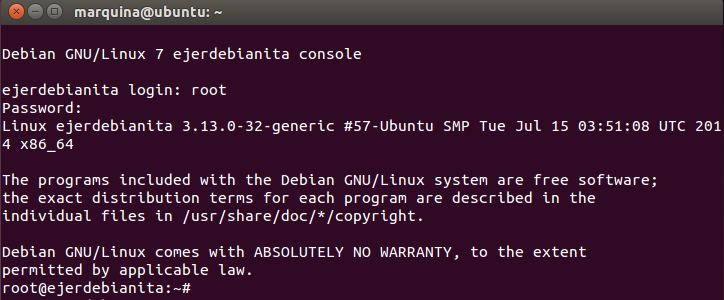
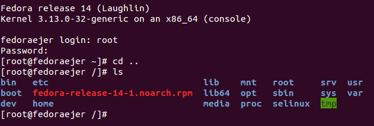

### EJERCICIO  3 :

###### 1)

En el ejercicio anterior hemos realizado algo similar a este, sólo que ahora lo vamos a realizar con Debian (pero los pasos serán exactamente los mismos cambiando solo el primer comando que en vez de ubuntu-cloud será debian), para ello creamos el contenedor como ya sabeos con el comando:`sudo lxc-create -t debian -n ejerdebianita` (notar que hemos cambiado el nombre de la distribución y del contenedor únicamente)

Recordar que si hubiera algún error a la hora de la creación las posibles soluciones las explique en el [ejercicio anterior](2.md)

También observamos que al crearlo nos dará otro usuario y contraseña por defecto diferente de Ubuntu (esto era obvio porque no le iban a poner Ubuntu de usuario a un sistema operativo debian):

Ya solo queda arrancarlo y ejecutarlo con el comando `sudo lxc-start -n ejerdebianita`:

Como observamos se ha creado, arrancado y hemos iniciado sesión sin ningún problema
* * *

* * *

###### 2)

Este ejercicio lo he realizado bajo la versión de Ubuntu 14.04, que a la hora de instalar fedora nos dará errores (tal y como venía en los apuntes) para solucionarlos, debemos instalar una serie de herramientas que usará lxc al estar creando un contenedor basado en fedora, ya que entenderá que son las que tiene que usar. La primera herramienta que instalamos es "yum" con el comando `sudo apt-get install yum`.

Y luego instalamos "curl" con el comando `sudo apt-get install curl`.

Con estas dos herramientas ya tenemos lo que necesitamos para crear correctamente el contenedor en fedora con lxc (ya que al ser fedora usará estas por defecto).

Ahora es como en los pasos anteriores, creamos el contenedor especificando la distribución (fedora en mi caso) y el nombre del contenedor, con el comando `sudo lxc-create -t fedora -n ejerfedora`.

Cuando se cree nos dirá dónde está almacenada nuestra contraseña de "root", y se nos recomienda cambiarla nada más logear:

Ahora lo arrancamos igual que el resto de tápers con el comando `sudo lxc-start -n ejerfedora` , y observamos que tiene un fallo con el kernel:

Este fallo se debe a la diferencia de kernel (ya que de ahí surge el primer fallo), una forma de solucionarlo sería instalar otra distribución de fedora que no de ese error con el kernel. Vamos a comprobarlo instalando la distribución fedora14, para ello creamos un táper con el comando:`sudo lxc-create -t fedora -n fedoraejer -- -R 14`

Al igual que con el fedora 20 nos dice dónde se encuentra la contraseña temporal de root y se nos recomienda que la cambiemos, para ello procedemos a mirar la contraseña dónde se nos indica mediante el comando:`sudo cat /var/lib/lxc/fedoraejer/tmp_root_pass`

Yo recomiendo cambiar la contraseña directamente antes de acceder para no estar teniendo que mirarla para ello usamos el comando que se nos indica al crear el táper:`sudo chroot /var/lib/lxc/fedoraejer/rootfs passwd`.

Ahora ya podemos acceder y arrancar el táper con el comando:` sudo lxc-start -n fedoraejer `, e introduciendo nuestro usuario "**root**" y contraseña (la de por defecto o la que hallamos establecido, como en mi caso).

Y vemos que efectivamente se ha arrancado y ejecutado correctamente.
