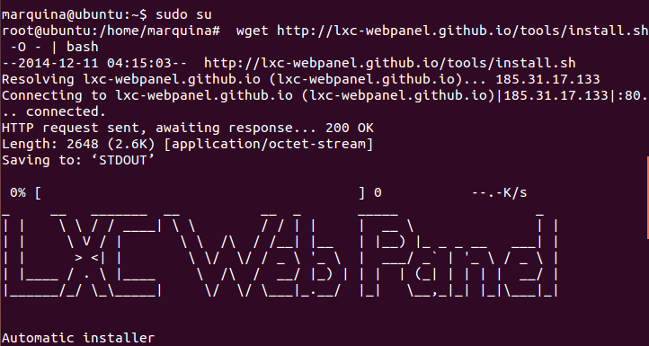
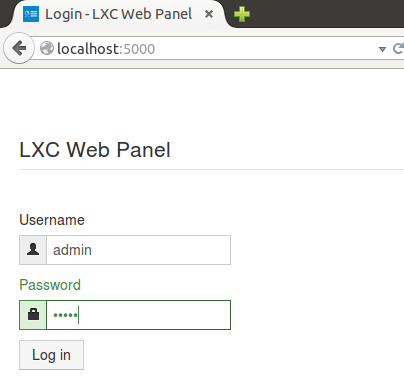
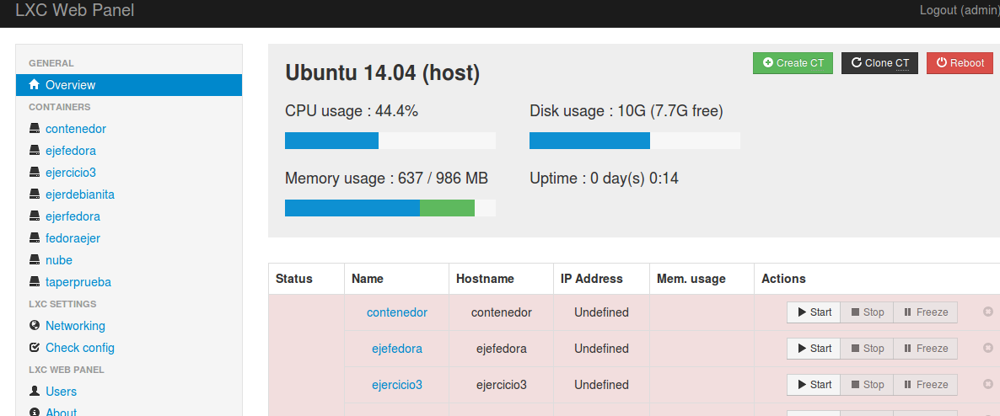
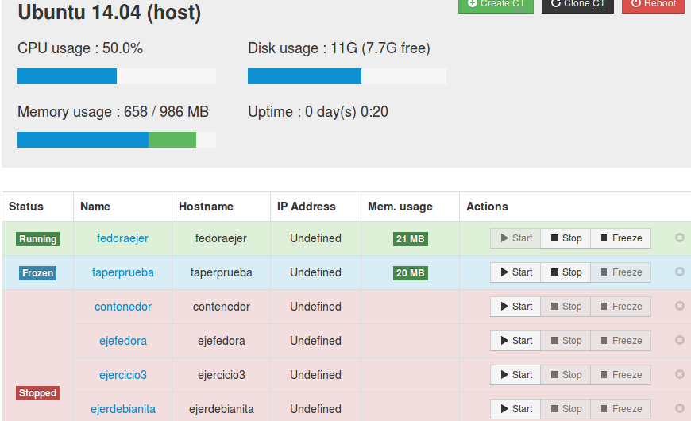
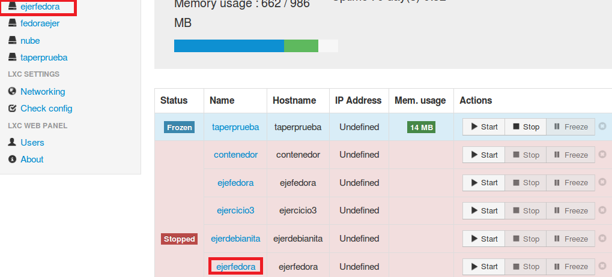
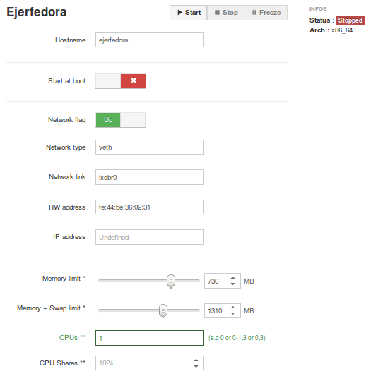

### EJERCICIO  4 :

###### 1)

Para instalar **lxc-webpanel**, usamos el siguiente comando:`wget http://lxc-webpanel.github.io/tools/install.sh -O - | bash`. Pero antes es muy importante que seamos **"root"** o de lo contrario no se nos instalará correctamente, para ser root usamos el comando `sudo su`.

Ahora ya podemos usar el centro de control por web abriendo un navegador y poniendo la dirección `localhost:5000/`, usando el usuario y contraseña "admin" (ambas por defecto).

Al acceder veremos todos nuestros contenedores, junto a información relevante de nuestro Host.

En el panel inferior podremos arrancar, parar y congelar cualquier contenedor de los que tenemos creados. Vamos a probarlo arrancando 2 máquinas y congelando una de las que acabo de arrancar:

Como podemos observar en la captura, funciona a la perfección y con un simple clic en el botón correspondiente, según la opción que deseemos (arrancar, parar, congelar).

* * *

* * *

###### 2)

Yo voy a editar el contenedor que he creado en el ejercicio anterior con fedora, para ello basta con clicar en el nombre del contenedor (da igual si el panel izquierdo o el inferior, notar que están señalados ambos en rojo), pero este contenedor debe estar sin ejecutar(es decir, en stop) o nos dará un error interno al aceptar la nueva configuración.

Una vez dentro de la configuración del contenedor puedo restringir los recursos que puede usar: CPU shares, CPUs que se pueden usar y cantidad de memoria. Los restringimos como se puede ver en la siguiente captura, y le damos a `apply`.

Y ya tenemos restringidos los recursos de este contenedor.
