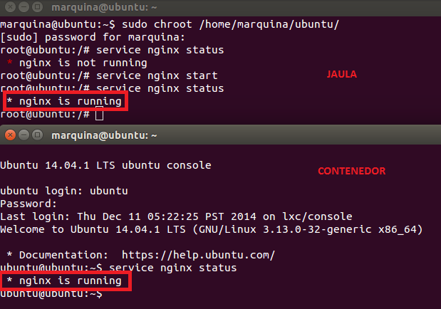
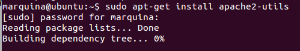
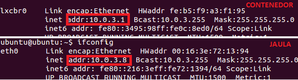
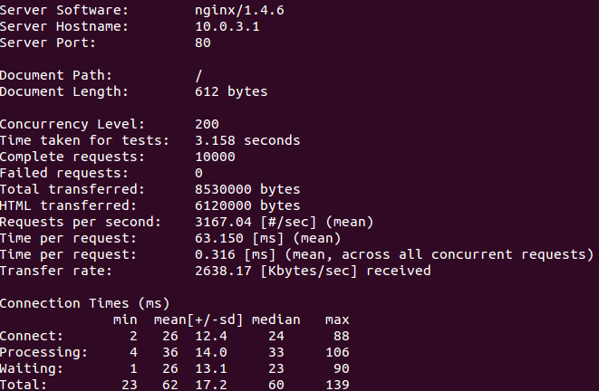
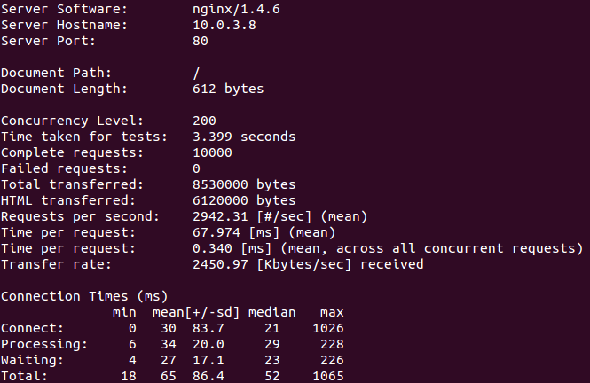

### EJERCICIO  5 :

Para realizar esta medición correctamente usare tanto en la jaula como en el contenedor el mismo sistema operativo, he elegido Ubuntu. Lo primero antes de nada es comprobar que tenemos en la jaula y contenedor nginx instalado (deberíamos tenerlo ya que nos hizo falta para un ejercicio del tema 3) y ejecutándose, para ello accedemos a la jaula, con el comando: `sudo chroot /home/marquina/ubuntu/` , y al contenedor con el comando :`sudo lxc-start -n ubuntu`, y en ambos comprobamos que efectivamente está ejecutándose nginx con `service nginx status`:

Ahora que ya tenemos nginx funcionando en ambos (jaula y contenedor) procedemos a realizar los test para ello vamos a ejecutar Apache Benchmark en el host, en caso de no tenerlo instalado ejecutamos el comando : ``

Como para ejecutar apache necesitamos saber la IP de dónde vamos a ejecutar los test, la obtenemos del contenedor y de la jaula con el comando `ifconfig`

Ahora ya nos disponemos a realizar los test mediante el comando:

1. CONTENEDOR : `ab -n 10000 -c 200 http://10.0.3.1/`

2. JAULA :`ab -n 10000 -c 200 http://10.0.3.8/`

Que realizará 10000 peticiones (-n 10000) y 200 concurrentes (-c 200).

Viendo los resultados y que las páginas que se servían eran las mismas (la de por defecto de nginx), es fácil ver que el contenedor es más eficiente (tarda menos en dar las respuestas, y en realizar el test completo, lo cual es obvio si tarda menos en dar las respuestas).
Aunque esto sería más realista si hubiéramos hecho peticiones de contenido más complejo (páginas más pesadas, aplicaciones, etc).