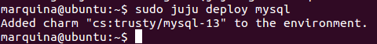

### EJERCICIO  6 :

###### 1)

Instalar **juju** es tan sencillo como seguir los apuntes de teoría, para ello añadimos el repositorio del desarrollador de juju, con el comando :`sudo add-apt-repository ppa:juju/stable`, y luego actualizamos los contenidos e instalamos juju con el comando `sudo apt-get update && sudo apt-get install juju-core`:

Y ya tenemos **juju **instalado correctamente.

* * *

* * *

###### 2)

Antes de instalar MySQL en un táper, necesitaremos configurar juju para trabajar en local.
Para ello primero lo iniciamos con `juju init`

Ahora en el archivo que contiene información sobre los entornos (que al iniciar juju nos sale), accedemos a él con el comando `nano .juju/environments.yaml`, y le modificamos la línea de `default: amazon` a `default: local` :

Después de modificar el archivo que contiene la información de los entornos, para poder trabajar en local con juju debemos también instalar MongoDB , para ello usamos el comando:`sudo apt-get install mongodb-server` 

Solo queda instalar el entorno local (que hemos puesto por defecto ya que vamos a usar en el archivo de la información sobre los entornos), con `sudo apt-get install juju-local` :

Y ya tenemos todo configurado para trabajar con juju en local.

Ahora crearemos el táper dónde instalaremos MySQL, esto es tan sencillo como ejecutar el comando `juju bootstrap` (ya que juju lo creará y configurara por defecto) :

Una vez creado el táper instalamos MySQL con el comando `sudo juju deploy mysql` (como se nos indica en los apuntes):

Comprobamos que se ha instalado correctamente observando la salida de `sudo juju status`:

Y efectivamente nuestro táper tiene instalado el servicio MySQL.

