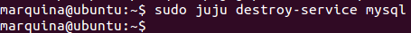
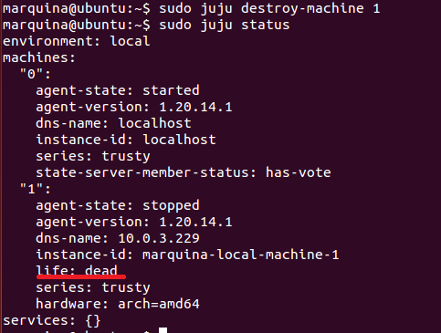
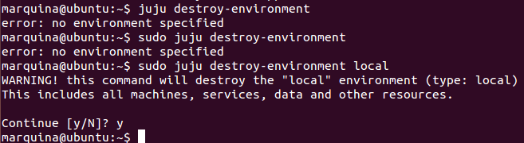
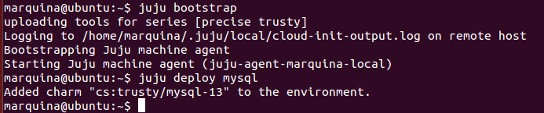
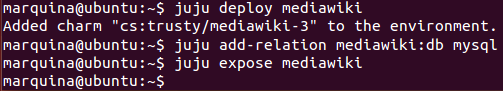
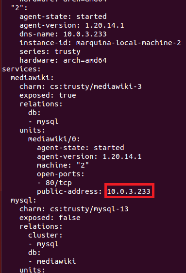
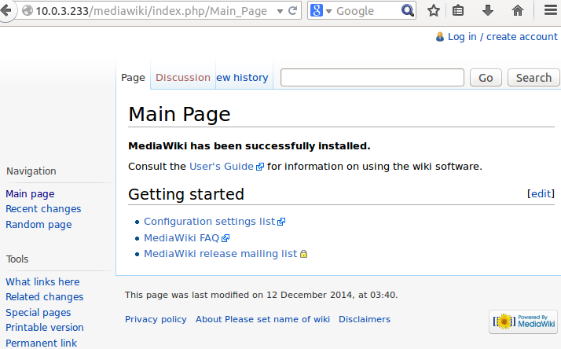
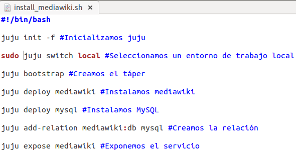
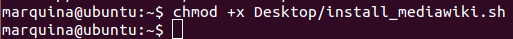
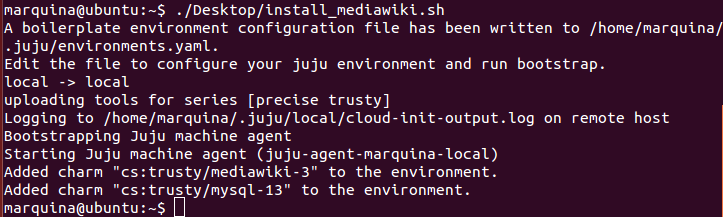

### EJERCICIO  7 :

###### 1)

Como sabemos de los apuntes para desmontar los servicios se tiene que hacer en orden inverso a su creación, por lo tanto lo primero será desmontar MySQL con el comando `sudo juju destroy-service mysql`:

Ahora una vez que nuestra máquina lo tiene todos desmontado (como es mi caso) podemos eliminarla con el comando `sudo juju destroy-machine 1`(notar que el número se debería cambiar si la máquina a eliminar es otra), y tras eliminarla comprobamos que se ha eliminado con `sudo juju status`:

Efectivamente vemos que se ha eliminado correctamente (life = dead) y no tiene ningún servicio montado (ya que si no, no habría podido eliminarla). Al poco tiempo si volvemos a realizar `sudo juju status`, solo nos quedara la máquina 0.

Por último eliminamos el entorno para no tener luego errores al crear más tápers, para ellos usamos el comando: `sudo juju destroy-environment local`

* * *

* * *

###### 2)

Para crear un táper con mediawiki, es tan sencillo como seguir los apuntes para ello vamos a volver a crear otra vez la máquina anterior hasta dónde la teníamos (con MySQL instalada), por lo que resumiré los pasos:

A) `juju bootstrap` (creamos máquina, eta se llamará por defecto 2, ya que no reutiliza los números)

B) `juju deploy mysql` (instalamos MySQL)

Ahora  ya estamos en el punto dónde lo dejamos antes de borrar el táper que teníamos, que solo le faltaba tener instalado el meadiwiki, añadirle la relación de mediawiki con MySQL (es decir, indicar que mediawiki va a usar MySQL) y  exponer el servicio para que pueda ser usado por el público, para ello usaremos los siguientes comandos:

A) Instalamos mediawiki `juju deploy mediawiki`

B) Creamos la relación : `juju add-relation mediawiki:db mysql`

C) Exponemos el servicio `juju expose mediawiki`

Ahora comprobamos que efectivamente esta todo correctamente con `juju status` (y de paso miraremos la IP para luego comprobar en el navegador que efectivamente funciona) :

Vemos que todo está correctamente y comprobamos que efectivamente funciona abriendo el navegador y poniendo la IP señalada:

* * *

* * *

###### 3)

Crear el Script es tan sencillo como poner todos los comandos que acabamos de usar en orden.
Para ello creamos en la máquina un archivo acabado en .sh (yo lo he llamado install_mediawiki.sh), y cuya primera línea sea `#!/bin/bash`, y ya después todos los comandos usados en orden.

Mi script ha sido el siguiente:

Ahora comprobamos que efectivamente funciona, le damos permisos de ejecución `chmod +x Desktop/install_mediawiki.sh`:

Y ejecutamos el script con `./Desktop/install_mediawiki.sh` y observamos que funciona correctamente:

