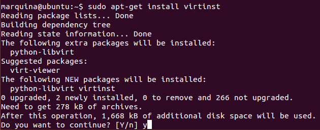
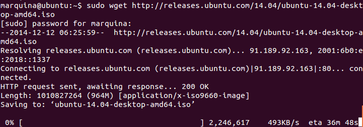
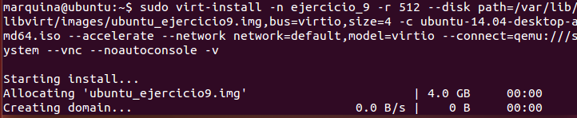

### EJERCICIO  9 :

Para crear un táper(contenedor) usando virt-install, lo primero de todo es instalar virt-install con el comando `sudo apt-get install virtinst`:

Antes necesitaremos descargarnos la imagen que vamos a instalar con el comando`sudo wget http://releases.ubuntu.com/14.04/ubuntu-14.04-desktop-amd64.iso`:

Una vez tenemos Virt-install instalado y la imagen descargada, siguiendo la guía facilitada en los [apuntes](https://help.ubuntu.com/12.04/serverguide/libvirt.html), creamos el contenedor instalándolo directamente con virt-install (que como se recomienda en los apuntes  facilita mucho la labor posterior), con el comando: `sudo virt-install -n ejercicio_9 -r 512 --disk path=/var/lib/libvirt/images/ubuntu_ejercicio9.img,bus=virtio,size=4 -c ubuntu-14.04-desktop-amd64.iso --accelerate --network network=default,model=virtio --connect=qemu:///system --vnc --noautoconsole -v`

Dónde los componentes más importantes a la hora de crear el táper han sido: 
1. Hemos asignado el nombre ejercicio_9(-n ejercicio_9).
1. Hemos asignado 512MB de Ram(-r 512).
1. Hemos dejado 4Gb de espacio (size=4).
1. Hemos definido el directorio dónde se almacenara nuestro disco virtual(--disk path...).
1. Hemos definido la imagen a instalar (-c ubuntu-14.04-desktop-amd64.iso)

