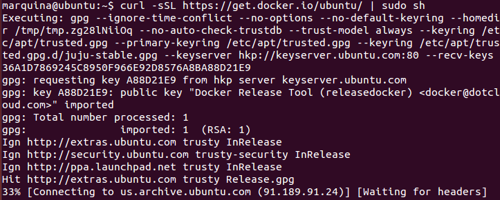
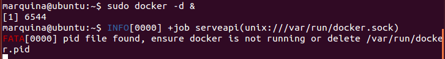
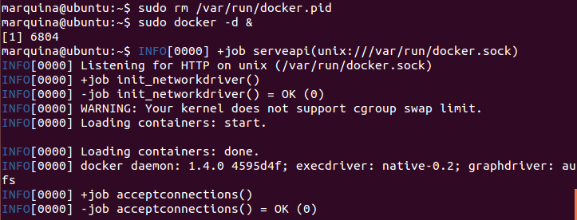

### EJERCICIO  10 :

Como sabemos de los apuntes instalar Docker es fácil pero no directo, pero aun siendo no directo existe un script que nos va a facilitar todo, ya que automatiza toda la tarea de instalación (y además nos instalará la última versión disponible).
Para instalarlo debemos tener curl instalado, si no lo tenemos recordar que el comando es` sudo apt-get install curl `.
Y ya solo nos queda usar la herramienta para ejecutar el script que hemos mencionado con el comando: `curl -sSL https://get.docker.io/ubuntu/ | sudo sh  `

Comprobamos que funciona correctamente ejecutándolo con `sudo docker -d &` y en mi caso, observamos que me da un fallo tras ejecutarse:

Observamos el error, y seguimos las instrucciones que nos da el propio error (eliminar el archivo /var/run/docker.pid),lo hacemos con `sudo rm /var/run/docker.pid `, y volvemos a ejecutar ahora docker con `sudo docker -d &` para comprobar si hemos arreglado nuestro problema :

Observamos que efectivamente se ha ejecutado perfectamente.