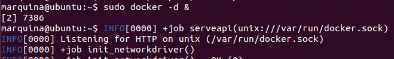
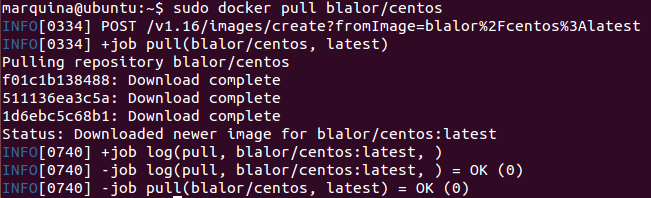
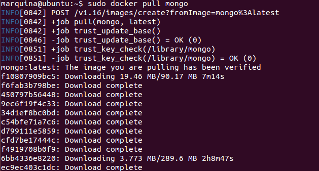

### EJERCICIO  11 :

###### 1)

Lo primero arrancamos docker con `sudo docker -d &`:

Ahora creamos el contenedor con la imagen que hayamos elegido (en mi caso ha sido un [Bare-bones basado en CentOs 6.5](https://registry.hub.docker.com/u/blalor/centos/)), con el comando: `sudo docker pull blalor/centos`

* * *

* * *

###### 2)

La imagen que voy a instalar que contiene MongoDB es la de su [repositorio oficial en docker](https://registry.hub.docker.com/_/mongo/), para ellos usamos el comando `sudo docker pull mongo`:

