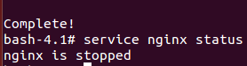

### EJERCICIO  12 :

Como viene en los apuntes, accedemos al contenedor que cree en el ejercicio anterior con el comando `sudo docker run -i -t blalor/centos /bin/bash ` . 

Una vez estamos dentro de nuestro contenedor, procedemos a ejecutar el usuario con el comando `adduser marqui`

Accedemos nuestro usuario creado con `su marqui` para ver que lo hemos creado correctamente:

Una vez hemos comprobado que funciona correctamente, salimos con el comando `exit` e instalamos nginx con el comando `yum install nginx`:

Ahora solo queda comprobar que efectivamente lo hemos instalado correctamente y está funcionando con el comando `service nginx status`:

Vemos que esta parado, por lo que lo arrancamos con `service nginx start` y ya lo tenemos instalado y funcionando en nuestro contenedor:

