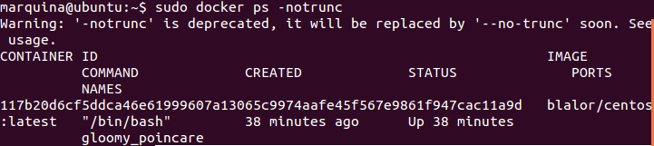
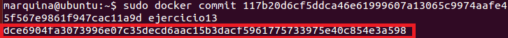
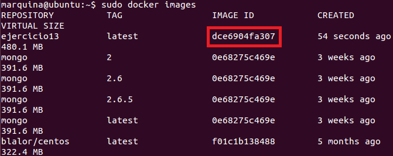

### EJERCICIO  13 :

Para crear una imagen persistente (es decir, que se guarden los cambios que hemos realizado), primero necesitamos el ID largo de la imagen que queremos hacer persistente para ello ejecutamos `sudo docker ps -notrunc`:

Ya con la ID, lo que vamos a hacer es guardar el contenedor en el estado que lo tenemos (con el usuario creado y con nginx instalado), creando un nuevo contenedor con un nombre distinto (en mi caso se guardara con el nombre de ejercicio13), con el comando `sudo docker commit 117b20d6cf5ddca46e61999607a13065c9974aafe45f567e9861f947cac11a9d ejercicio13`:

Observamos que se nos devuelve el ID del nuevo contenedor que acabamos de crear (es decir, nuestro contenedor ejercicio13), como podemos observar al obtener los contenedores (veremos que coincide la ID corta con el principio de la ID larga) con el comando ` sudo docker images`:

