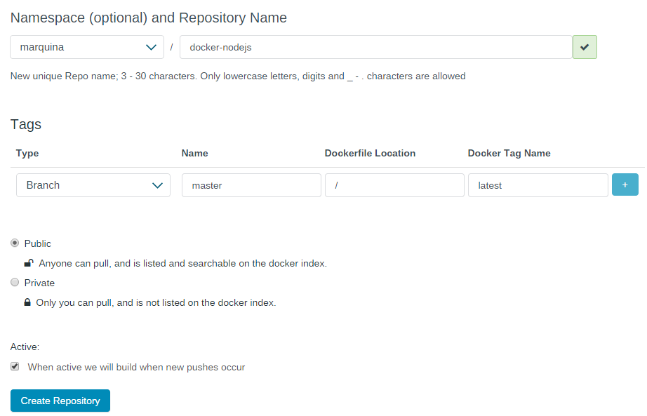

### EJERCICIO  14 :

Para ello debemos de crear un repositorio en Docker siguiendo los siguientes pasos:

1) En nuestra cuenta de Docker (doy por hecho que ya estamos registrados), le damos a agregar repositorio con Automated build:

2) Luego seleccionamos que automatice usando GitHub, con la opción de Public and Private (que es además la recomendada). Tras esto nos pedirá autorización para acceder a nuestra cuenta de GitHub:

3) Después de autorizarlo deberemos seleccionar un repositorio, yo he seleccionado uno dónde realizo las [pruebas del servidor](https://github.com/marquina91/docker_nodejs), y tras seleccionarlo nos salen una serie de opciones (nombre del repositorio, si lo queremos público o privado, y si queremos que vaya construyendo el contenedor cuando este activo), y se nos informa que para la descripción del contenedor usará nuestro readme:

Tras crear el repositorio, ya tendremos nuestro contenedor creado y listo para descargar, con lo que necesita para funcionar correctamente.

