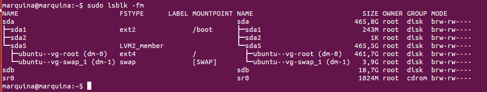

### EJERCICIO 1 :

Para saber cómo tengo instalado el disco duro, sus particiones y de qué tipo son, uso el comando `sudo lsblk -fm`:

Observamos en la captura anterior y vemos que:

###### sda

sda, es el primer disco, este contiene 3 particiones primarias (sda1, sda2, sda5).

De ellas cabe destacar la sda5, partición extendida para Linux que dispone de 2 particiones lógicas: 

- Una para el montaje de ubuntu

- Otra para el swap

###### sdb

sdb, hace referencia al disco SSD (20GB) que lleva mi portátil.

###### sr0

sr0, corresponde a la unidad de CD-ROM.

