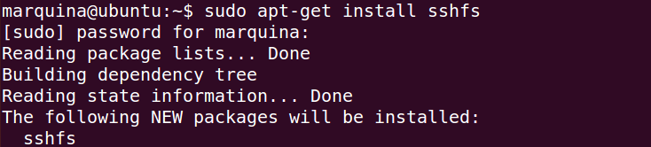
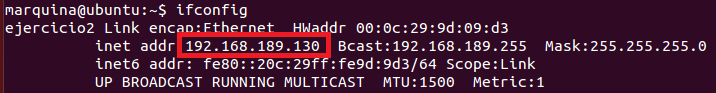
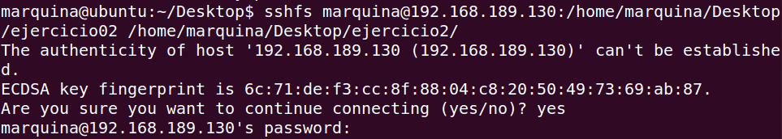

### EJERCICIO 2 :

Para realizar este ejercicio debemos tener instalado FUSE (en ambas máquinas), para ello ejecutamos el comando `sudo apt-get install sshfs`:

y obtenemos la IP de la máquina remota con `ifconfig`:

Con esta IP y habiendo creado la carpeta ejercicio02(con `mkdir ejercicio02`) en la máquina remota, ejecutamos el comando:
`sshfs marquina@192.168.189.130:/home/marquina/Desktop/ejercicio02 /home/marquina/Desktop/ejercicio2` 

Con esto ya tenemos creado un directorio en la maquina remota como si fuera local, y todo lo que introduzcamos en esa carpeta también aparecerá en el otro directorio asociado de la otra máquina.