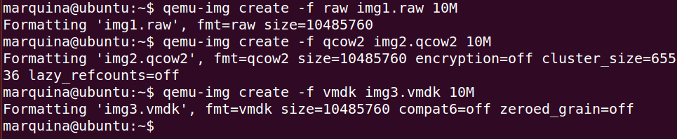

### EJERCICIO 3 :

Vamos a crear las imágenes con los formatos indicados en los apuntes mediante la herramienta qemu-img:

1. raw con el comando: `qemu-img create -f raw img1.raw 10M`

2. qcow2 con el comando: `qemu-img create -f qcow2 img2.qcow2 10M`

3. vmdk con el comando: `qemu-img create -f vmdk img3.vmdk 10M`

Ahora para manipularlas las montamos:

1. raw con el comando: `sudo mount -t ntfs  -o loop /home/marquina/img1.raw /mnt/image`

2. qcow2 con el comando: `sudo mount -t ntfs  -o loop /home/marquina/img2.qcow2 /mnt/image`

3. vmdk con el comando: `sudo mount -t ntfs  -o loop /home/marquina/img3.vmdk /mnt/image`