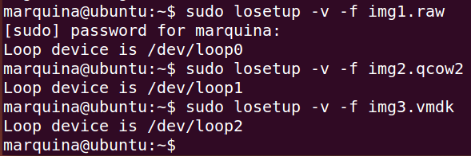
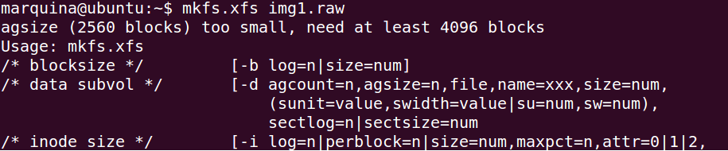
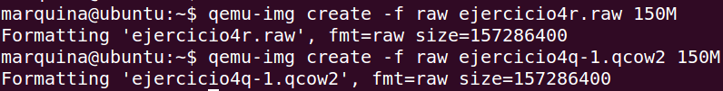
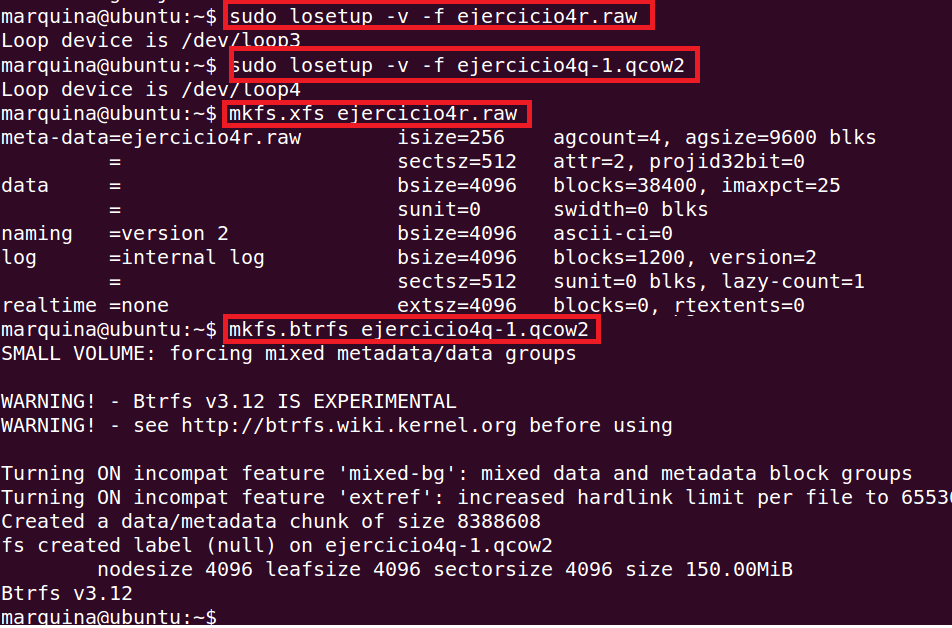
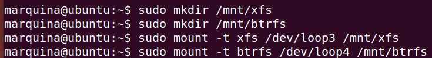
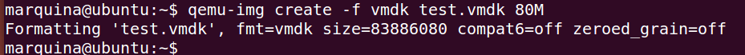
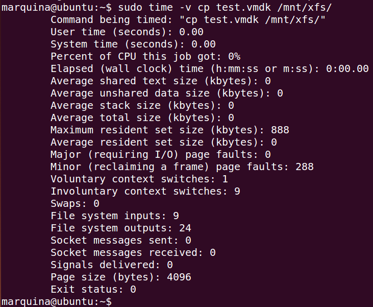
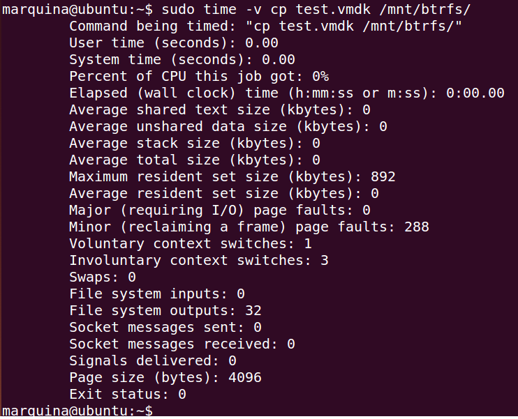
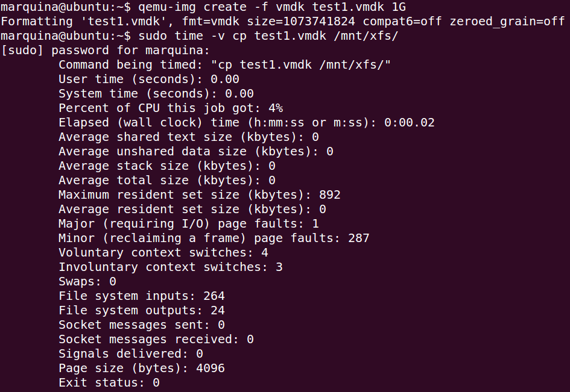
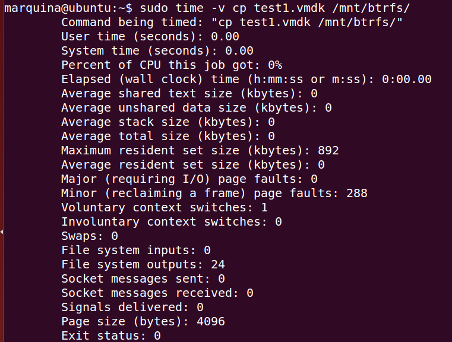

### EJERCICIO 4 :

En este ejercicio voy a reutilizar las imágenes usado en el ejercicio anterior, primero las ponemos accesibles con losetup, para ello usamos los siguientes comandos:

- `sudo losetup -v -f img1.raw `

- `sudo losetup -v -f img2.qcow2`

- ` sudo losetup -v -f img3.vmdk `

Siguiendo los apuntes de la asignatura, le vamos a dar formato a nuestras imágenes(se la voy a dar a 2 de ellas para comprobar luego las distintas prestaciones) con los siguientes comandos(antes debemos tener instalado xfsprogs con el comando `sudo apt-get install xfsprogs` y también btrfs-tools con:`sudo apt-get install btrfs-tools`):

- ` mkfs.xfs img1.raw`

- ` mkfs.btrfs imagen2.qcow2`

Es importante crear 2 imágenes nuevas con más tamaño ya que las que use en el ejercicio anterior eran demasiado pequeñas y saldrá sino el siguiente error al formatearlas:

Por lo tanto creamos 2 nuevas con :

- ` qemu-img create -f raw ejercicio4r.raw 150M`

- `  qemu-img create -f qcow2 ejercicio4q-1.qcow2 150M`

Y volvemos a seguir los pasos hasta tenerlas con el nuevo formato:

Ahora que ya las tenemos con el formato creamos el punto de montaje de cada una, para ello usamos los siguientes comandos:

- `sudo mkdir /mnt/xfs`
- `sudo mkdir /mnt/btrfs`

Y montamos las imágenes en estos puntos de montaje con :
- `sudo mount -t xfs /dev/loop3 /mnt/xfs`
- `sudo mount -t btrfs /dev/loop4 /mnt/btrfs`

Ahora creamos una imagen para probar en que sistema de ficheros se copia con más velocidad, para ello usamos el comando `qemu-img create -f vmdk test.vmdk 80M`

Y ahora ya comprobamos cuánto tarda en copiarse con `sudo time -v cp test.vmdk /mnt/xfs/`:

y con `sudo time -v cp test.vmdk /mnt/btrfs/`:

A la vista de los resultados no podemos deducir nada, por lo tanto vamos a realizar otra vez los test pero creando ahora un archivo más grande. Para eso ejecutamos `qemu-img create -f vmdk test.vmdk 1G` y volvemos a realizar los test:

- xfs: `sudo time -v cp test1.vmdk /mnt/xfs/`:

 

- btrfs: `sudo time -v cp test1.vmdk /mnt/btrfs/`:

 
 
 Y ahora sí, observamos que en sistema de ficheros de XFS es más lento, ya que ha necesitado más porcentaje de CPU para llevar acabo la misma tarea.