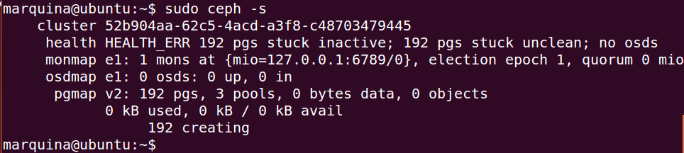

### EJERCICIO 6 :

Lo primero que debemos hacer y siguiendo los apuntes de la asignatura es instalarnos los paquetes que nos harán falta para este ejercicio para ello ejecutamos `sudo apt-get install ceph-mds` (en mi caso ya estaban instalados).

Una vez los tenemos creamos los directorios dónde vamos a almacenar la información de ceph, para ello ejecutamos el comando`sudo mkdir -p /srv/ceph/{osd,mon,mds}` :

Ahora vamos a crear el fichero de configuración con `sudo nano /etc/ceph/ceph.conf` que tendrá el siguiente contenido:

    [global]
    log file = /var/log/ceph/$name.log
    pid file = /var/run/ceph/$name.pid
    [mon]
    mon data = /srv/ceph/mon/$name
    [mon.mio]
    host = ubuntu
    mon addr = 127.0.0.1:6789
    [mds]
    [mds.mio]
    host = ubuntu
    [osd]
    osd data = /srv/ceph/osd/$name
    osd journal = /srv/ceph/osd/$name/journal
    osd journal size = 1000 ; journal size, in megabytes
    [osd.0]
    host = ubuntu
    devs = /dev/loop0

Luego creamos la imagen donde se almacenaran los objetos (y siguiendo las recomendaciones de los apuntes lo formatearemos con XFS), para ello ejecutamos las siguientes instrucciones (que deben sonarnos del ejercicio 4):

1. `qemu-img create -f raw ceph 600M`

2. `sudo losetup -v -f ceph`

3. `sudo mkfs.xfs /dev/loop0`

Ahora creamos el directorio `/srv/ceph/osd/osd.0` para evitar errores, con el comando ` sudo mkdir /srv/ceph/osd/osd.0`.

Y ya podemos crear nuestro sistema de ficheros de objetos con `sudo /sbin/mkcephfs -a -c /etc/ceph/ceph.conf `

Ya tenemos el sistema ceph creado, asique ahora lo iniciamos el servicio con `sudo /etc/init.d/ceph -a start`

Comprobamos que todo ha ido bien con `sudo /etc/init.d/ceph -a start`

Por último nos creamos el directorio dónde montaremos el sistema de ficheros con `sudo mkdir /mnt/ceph`, y ya solo queda montarlo con `sudo mount -t ceph ubuntu:/ /mnt/ceph` .