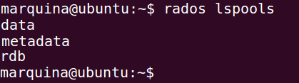
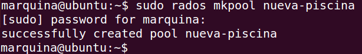

### EJERCICIO 7 :

Comprobamos que tenemos los directorios(cubos) dónde meteremos los distintos objetos con `rados lspools` :

Ahora vamos a crear un nuevo directorio(cubo) con `sudo rados mkpool nueva-piscina`:

Y ya solo queda añadirle un fichero que deseemos almacenar con `rados put -p nueva-piscina obj doc.txt`