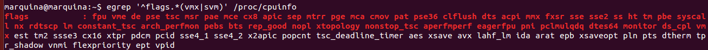

### EJERCICIO 1 :

Siguiendo los pasos del tema 1, comprobamos si la BIOS tiene la virtualización habilitada con `egrep '^flags.*(vmx|svm)' /proc/cpuinfo`:

Al devolvernos un listado significa que efectivamente tenemos la virtualización habilitada.